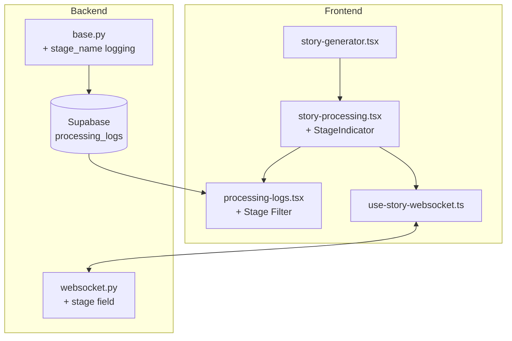

# Pipeline Visibility UI - Implementation Plan

## Executive Summary

This plan provides two implementation approaches for adding **pipeline visibility** to the Code Story Platform. Users will be able to:

1. See the entire 4-agent process of analyzing a repository
2. View what information is prompted into Claude for script generation
3. Visualize the generation process as a configurable pipeline
4. See real-time logs/tail after pressing "Generate"
5. (Future) Configure various stages of the pipeline

**Current State**: Progress bar + generic status messages + processing logs (no per-agent visibility)
**Target State**: Full pipeline visualization with stage-level metrics, timing, and prompt visibility

---

## Current State Analysis

### Existing Pipeline Architecture

```
Intent Agent (5-15%)     → Validates request, refines parameters
    ↓
Analyzer Agent (15-50%)  → Runs RepoMix, analyzes code structure
    ↓
Architect Agent (50-70%) → Creates narrative script with chapters
    ↓
Voice Director (70-75%)  → Optimizes text for speech synthesis
    ↓
Audio Synthesis (75-100%) → ElevenLabs TTS, uploads to storage
```

### What's Visible Today

| Capability | Status |
|------------|--------|
| Progress % (0-100) | ✅ Via Supabase + WebSocket |
| Processing logs | ✅ Via Supabase Realtime |
| Status transitions | ✅ pending→analyzing→generating→synthesizing→completed |
| Error messages | ✅ Displayed when status=failed |

### What's Missing

| Gap | Impact |
|-----|--------|
| Per-agent stage visibility | Can't see which of 4 agents running |
| Claude token usage | No cost/usage monitoring |
| Per-stage timing | Can't identify bottlenecks |
| Prompt/response visibility | No insight into AI reasoning |
| RepoMix output | Analysis details hidden |

### Key Files (Current State)

**Backend:**
- `/backend/app/agents/pipeline.py` - Orchestration
- `/backend/app/agents/base.py` - Base agent with Claude integration
- `/backend/app/api/websocket.py` - WebSocket handler
- `/backend/app/tasks/story_pipeline.py` - Celery task

**Frontend:**
- `/components/story-generator.tsx` - Main generation UI
- `/components/story-processing.tsx` - Progress visualization
- `/components/processing-logs.tsx` - Log stream display
- `/hooks/use-story-websocket.ts` - WebSocket connection

---

## Approach A: Incremental Enhancement

### Philosophy
Build on existing components with minimal backend changes. Quick wins, lower risk, faster delivery.

### Architecture Diagram



### Phase Breakdown

#### Phase A1: Backend Stage Tracking (4h)
**Goal:** Add stage identification to processing logs

**Files to Modify:**
- `/backend/app/agents/base.py` - Add `stage_name` parameter to `log()` method
- `/backend/app/agents/intent_agent.py` - Pass stage="intent"
- `/backend/app/agents/analyzer_agent.py` - Pass stage="analyzer"
- `/backend/app/agents/architect_agent.py` - Pass stage="architect"
- `/backend/app/agents/voice_agent.py` - Pass stage="voice_director"
- `/backend/app/tasks/story_pipeline.py` - Add stage="synthesis" for audio

**Database Change:**
```sql
ALTER TABLE processing_logs ADD COLUMN stage_name VARCHAR(50);
```

**Effort:** 4h

#### Phase A2: Enhanced WebSocket Messages (3h)
**Goal:** Include current stage in status updates

**Files to Modify:**
- `/backend/app/api/websocket.py` - Add `current_stage` to status message
- `/backend/app/tasks/story_pipeline.py` - Track stage transitions

**New Message Format:**
```json
{
  "type": "status",
  "data": {
    "status": "analyzing",
    "progress": 25,
    "current_stage": "analyzer",
    "stage_started_at": "2026-01-07T14:30:00Z"
  }
}
```

**Effort:** 3h

#### Phase A3: Stage Indicator UI (6h)
**Goal:** Visual pipeline indicator showing which stage is active

**Files to Modify:**
- `/components/story-processing.tsx` - Add horizontal stepper component

**New Component Pattern:**
```
Intent → Analyzer → Architect → Voice → Synthesis
  ✓        ●          ○          ○         ○
```

**Implementation:**
- Use existing `AGENT_CONFIG` from processing-logs.tsx
- Stepper with 5 stages: Intent, Analyzer, Architect, Voice Director, Synthesis
- States: completed (✓), active (●/spinner), pending (○)
- Color coding per agent (reuse existing colors)

**Effort:** 6h

#### Phase A4: Collapsible Prompt Panel (8h)
**Goal:** Show Claude prompts/responses in expandable sections

**Files to Modify:**
- `/components/processing-logs.tsx` - Add prompt detail expansion
- `/backend/app/agents/base.py` - Ensure prompts logged with `prompt_type: "debug"`

**UI Pattern (Progressive Disclosure):**
```
┌─────────────────────────────────────────────┐
│ [Analyzer] Analyzing repository structure    │
│ ▶ Show AI Prompt                            │
└─────────────────────────────────────────────┘

Expanded:
┌─────────────────────────────────────────────┐
│ [Analyzer] Analyzing repository structure    │
│ ▼ Hide AI Prompt                            │
│ ┌─────────────────────────────────────────┐ │
│ │ System: You are a code analyzer...      │ │
│ │ User: Analyze this repository...        │ │
│ │ [Copy Prompt] [Copy Response]           │ │
│ └─────────────────────────────────────────┘ │
└─────────────────────────────────────────────┘
```

**Effort:** 8h

#### Phase A5: Stage Timing Display (4h)
**Goal:** Show elapsed time per stage

**Files to Modify:**
- `/backend/app/agents/base.py` - Log start/end timestamps per stage
- `/components/story-processing.tsx` - Display timing badges

**Display Format:**
```
Intent (12s) → Analyzer (2m 34s) → Architect (active: 45s) → ...
```

**Effort:** 4h

#### Phase A6: Terminal-Style Log Viewer (7h)
**Goal:** Enhanced log display with search/filter and auto-scroll

**Files to Modify:**
- `/components/processing-logs.tsx` - Rewrite with xterm.js or virtualized list

**Features:**
- Search/filter input (debounced 300ms)
- Stage filter dropdown
- Level filter (info, success, warning, error)
- Auto-scroll toggle
- Jump to latest button
- ANSI color support (if using xterm.js)

**Effort:** 7h

### Total Effort: 32h

### Pros/Cons

| Pros | Cons |
|------|------|
| Low risk - builds on existing code | Limited metrics depth |
| Fast delivery (1-2 sprints) | No cost tracking |
| Minimal backend changes | No historical comparison |
| Easy rollback | Manual refresh for some updates |

### Risk Assessment

| Risk | Likelihood | Impact | Mitigation |
|------|------------|--------|------------|
| WebSocket message size increase | Low | Low | Pagination if needed |
| Supabase Realtime lag | Medium | Low | Fallback to polling |
| xterm.js bundle size | Low | Medium | Dynamic import |

---

## Approach B: Pipeline Dashboard Redesign

### Philosophy
New dedicated pipeline visualization with full observability. Higher effort, better long-term architecture.

### Architecture Diagram

```mermaid
graph TB
    subgraph Frontend
        PD[PipelineDashboard]
        ST[StageTimeline]
        PM[PromptViewer]
        MT[MetricsPanel]
        LT[LiveTail]
    end

    subgraph Backend
        PE[PipelineEngine<br/>with EventEmitter]
        SSE[SSE Endpoint<br/>/api/stories/{id}/stream]
        MET[MetricsCollector]
    end

    subgraph Database
        SM[(stage_metrics)]
        PL[(processing_logs)]
        ST2[(stories)]
    end

    PD --> ST
    PD --> PM
    PD --> MT
    PD --> LT

    ST <--> SSE
    LT <--> SSE
    MT --> MET

    PE --> SM
    PE --> PL
    MET --> SM
```

### Phase Breakdown

#### Phase B1: Database Schema Enhancement (4h)
**Goal:** New metrics table and enhanced logs schema

**New Migration:**
```sql
-- Stage metrics table
CREATE TABLE stage_metrics (
    id BIGSERIAL PRIMARY KEY,
    story_id BIGINT REFERENCES stories(id),
    stage_name VARCHAR(50) NOT NULL,
    started_at TIMESTAMP NOT NULL,
    ended_at TIMESTAMP,
    duration_ms INTEGER,
    status VARCHAR(20) DEFAULT 'running',
    input_tokens INTEGER,
    output_tokens INTEGER,
    cost_estimate DECIMAL(10,6),
    metadata JSONB,
    created_at TIMESTAMP DEFAULT NOW()
);

-- Enhanced processing_logs
ALTER TABLE processing_logs
ADD COLUMN stage_name VARCHAR(50),
ADD COLUMN token_usage JSONB,
ADD COLUMN duration_ms INTEGER;

-- Index for fast queries
CREATE INDEX idx_stage_metrics_story ON stage_metrics(story_id);
CREATE INDEX idx_stage_metrics_stage ON stage_metrics(stage_name);
```

**Effort:** 4h

#### Phase B2: Pipeline Engine Refactor (12h)
**Goal:** Event-driven pipeline with metrics collection

**New Files:**
- `/backend/app/agents/pipeline_engine.py` - Event emitter pattern
- `/backend/app/services/metrics_collector.py` - Centralized metrics

**Key Changes:**
```python
class PipelineEngine:
    def __init__(self, story_id: str):
        self.story_id = story_id
        self.metrics = MetricsCollector(story_id)

    async def run_stage(self, stage_name: str, agent: BaseAgent, **kwargs):
        self.metrics.start_stage(stage_name)
        try:
            result = await agent.run(**kwargs)
            self.metrics.end_stage(stage_name, success=True, result=result)
            return result
        except Exception as e:
            self.metrics.end_stage(stage_name, success=False, error=str(e))
            raise
```

**Files to Modify:**
- `/backend/app/agents/base.py` - Add token usage capture from Claude response
- `/backend/app/tasks/story_pipeline.py` - Use new PipelineEngine

**Effort:** 12h

#### Phase B3: SSE Streaming Endpoint (6h)
**Goal:** Replace WebSocket with SSE for simpler scalability

**New File:**
- `/backend/app/api/routes/stream.py` - SSE endpoint

**Endpoint:** `GET /api/stories/{story_id}/stream`

**Event Types:**
```
event: stage_start
data: {"stage": "analyzer", "timestamp": "..."}

event: progress
data: {"stage": "analyzer", "progress": 45, "message": "Running RepoMix..."}

event: log
data: {"level": "info", "agent": "Analyzer", "action": "...", "details": {...}}

event: stage_end
data: {"stage": "analyzer", "duration_ms": 154000, "tokens": {"input": 5000, "output": 2000}}

event: complete
data: {"audio_url": "...", "duration_seconds": 600}
```

**Effort:** 6h

#### Phase B4: Pipeline Dashboard Component (10h)
**Goal:** New dedicated dashboard for pipeline visualization

**New Files:**
- `/components/pipeline-dashboard.tsx` - Main container
- `/components/pipeline-dashboard/stage-timeline.tsx` - Visual stepper
- `/components/pipeline-dashboard/stage-card.tsx` - Expandable stage details
- `/components/pipeline-dashboard/metrics-panel.tsx` - Token/cost display

**Layout:**
```
┌─────────────────────────────────────────────────────────────┐
│ Story: vuejs/core                                           │
│ Started: 2:30 PM | Elapsed: 4m 23s | Est. Remaining: 2m    │
├─────────────────────────────────────────────────────────────┤
│ ┌──────┐  ┌──────┐  ┌──────┐  ┌──────┐  ┌──────┐          │
│ │Intent│→│Analyz│→│Archit│→│Voice │→│Synth │            │
│ │  ✓   │  │  ●   │  │  ○   │  │  ○   │  │  ○   │          │
│ │ 12s  │  │2m 34s│  │  -   │  │  -   │  │  -   │          │
│ └──────┘  └──────┘  └──────┘  └──────┘  └──────┘          │
├─────────────────────────────────────────────────────────────┤
│ [Analyzer] Running RepoMix analysis...              2m 34s  │
│ ├─ ✓ Repository cloned                                      │
│ ├─ ✓ RepoMix analysis complete                              │
│ └─ ● Claude analyzing code structure...                     │
│                                                             │
│ Tokens: 5,234 in / 2,100 out | Est. Cost: $0.12            │
├─────────────────────────────────────────────────────────────┤
│ ▶ Show AI Prompt                                            │
└─────────────────────────────────────────────────────────────┘
```

**Effort:** 10h

#### Phase B5: Prompt Viewer Modal (6h)
**Goal:** Dedicated modal for viewing prompts with syntax highlighting

**New File:**
- `/components/pipeline-dashboard/prompt-viewer.tsx`

**Features:**
- System prompt section (collapsible)
- User message section with variable highlighting
- Claude response section
- Copy buttons for each section
- Token count per section
- Syntax highlighting for code blocks

**Effort:** 6h

#### Phase B6: Live Tail Component (8h)
**Goal:** Terminal-style log viewer with xterm.js

**New File:**
- `/components/pipeline-dashboard/live-tail.tsx`

**Features:**
- xterm.js integration via react-xtermjs
- ANSI color support for log levels
- Search/filter with highlighting
- Stage filter tabs
- Auto-scroll with pause on user scroll
- Download logs button
- Max 10k lines with truncation

**Implementation:**
```typescript
import { useXTerm } from 'react-xtermjs';

export function LiveTail({ storyId }: { storyId: string }) {
  const { ref, instance } = useXTerm();

  useEffect(() => {
    const es = new EventSource(`/api/stories/${storyId}/stream`);
    es.addEventListener('log', (e) => {
      const log = JSON.parse(e.data);
      const color = LOG_COLORS[log.level];
      instance?.writeln(`${color}[${log.agent}] ${log.action}\x1b[0m`);
    });
    return () => es.close();
  }, [storyId, instance]);

  return <div ref={ref} className="h-[400px]" />;
}
```

**Effort:** 8h

#### Phase B7: Metrics Panel with Cost Tracking (6h)
**Goal:** Real-time token usage and cost estimation

**New File:**
- `/components/pipeline-dashboard/metrics-panel.tsx`

**Display:**
```
┌─────────────────────────────────────────┐
│ Pipeline Metrics                         │
├─────────────────────────────────────────┤
│ Total Tokens    │ 15,234 in / 8,100 out │
│ Estimated Cost  │ $0.47                  │
│ Total Duration  │ 6m 23s                 │
├─────────────────────────────────────────┤
│ Per Stage:                              │
│ Intent      │  1.2k/0.5k │ $0.02 │ 12s │
│ Analyzer    │  8.0k/3.2k │ $0.22 │ 2m  │
│ Architect   │  4.0k/3.5k │ $0.18 │ 3m  │
│ Voice Dir.  │  2.0k/0.9k │ $0.05 │ 45s │
└─────────────────────────────────────────┘
```

**Effort:** 6h

#### Phase B8: Integration & Polish (4h)
**Goal:** Wire everything together, handle edge cases

**Tasks:**
- Replace current story-processing.tsx with new dashboard
- Handle connection errors gracefully
- Add loading states
- Mobile responsive layout
- Accessibility (ARIA labels, keyboard nav)

**Effort:** 4h

### Total Effort: 56h

### Pros/Cons

| Pros | Cons |
|------|------|
| Full observability | Higher initial effort |
| Cost tracking | More complex architecture |
| Better scalability (SSE) | Migration required |
| Historical comparison ready | Longer delivery time |
| Professional dashboard UI | More testing surface |

### Risk Assessment

| Risk | Likelihood | Impact | Mitigation |
|------|------------|--------|------------|
| Database migration issues | Low | High | Test on staging first |
| SSE browser compatibility | Low | Medium | Polyfill available |
| xterm.js performance | Medium | Low | Virtualization built-in |
| Pipeline refactor bugs | Medium | High | Feature flag rollout |

---

## Comparison Table

| Aspect | Approach A | Approach B |
|--------|-----------|-----------|
| **Effort** | 32h | 56h |
| **Delivery** | 1-2 sprints | 3-4 sprints |
| **Risk** | Low | Medium |
| **Stage visibility** | ✅ Basic | ✅ Full |
| **Timing data** | ✅ Per-stage | ✅ Per-stage + historical |
| **Token tracking** | ❌ | ✅ |
| **Cost estimation** | ❌ | ✅ |
| **Prompt visibility** | ✅ Inline expand | ✅ Dedicated modal |
| **Log viewer** | ✅ Enhanced | ✅ Terminal-style |
| **SSE vs WebSocket** | WebSocket | SSE |
| **Future configurability** | Limited | Ready |
| **Historical comparison** | ❌ | Ready with stage_metrics |

---

## Recommendation

### Start with Approach A, migrate to B

**Rationale:**
1. **Quick wins**: Approach A delivers visible value in 1-2 sprints
2. **Validate assumptions**: User feedback on stage visibility needs before full investment
3. **Low risk**: No database migrations, minimal backend changes
4. **Foundation building**: Phase A1-A2 backend changes are reusable in Approach B
5. **Incremental migration**: Can add Approach B phases later without throwaway work

**Suggested Sequence:**
1. **Sprint 1**: Phases A1-A3 (Stage tracking + indicator UI) - 13h
2. **Sprint 2**: Phases A4-A5 (Prompt panel + timing) - 12h
3. **Sprint 3**: Phase A6 (Terminal log viewer) - 7h
4. **Future**: Evaluate need for Approach B based on user feedback

**Decision Point**: After Sprint 2, assess if cost tracking and historical comparison are needed to justify Approach B investment.

---

## Phase Breakdown (Recommended Approach A)

| Phase | Description | Effort | Dependencies |
|-------|-------------|--------|--------------|
| A1 | Backend stage tracking | 4h | None |
| A2 | Enhanced WebSocket messages | 3h | A1 |
| A3 | Stage indicator UI | 6h | A2 |
| A4 | Collapsible prompt panel | 8h | A1 |
| A5 | Stage timing display | 4h | A1, A3 |
| A6 | Terminal-style log viewer | 7h | None |

**Critical Path**: A1 → A2 → A3 → A5 (17h for core pipeline visibility)

---

## Technical Details

### UI Components Needed

**Approach A:**
- `StageIndicator` - Horizontal stepper (5 stages)
- `PromptExpandable` - Collapsible prompt section
- `TimingBadge` - Duration display with active timer
- Enhanced `ProcessingLogs` with filtering

**Approach B (additional):**
- `PipelineDashboard` - Main container
- `StageTimeline` - Interactive timeline
- `StageCard` - Expandable stage details
- `MetricsPanel` - Token/cost display
- `PromptViewer` - Full-screen modal
- `LiveTail` - xterm.js based log viewer

### Backend Changes Required

**Approach A:**
1. Add `stage_name` column to processing_logs
2. Modify `log()` method in BaseAgent to accept stage
3. Add `current_stage` to WebSocket status messages
4. Log start/end timestamps per stage

**Approach B (additional):**
1. New `stage_metrics` table
2. New `PipelineEngine` class with event emitter
3. New `MetricsCollector` service
4. SSE endpoint `/api/stories/{id}/stream`
5. Capture Claude token usage from response

### WebSocket/SSE Enhancements

**Approach A - WebSocket:**
```json
{
  "type": "status",
  "data": {
    "status": "analyzing",
    "progress": 25,
    "current_stage": "analyzer",
    "stage_started_at": "2026-01-07T14:30:00Z"
  }
}
```

**Approach B - SSE Events:**
- `stage_start`: Stage begins
- `progress`: Stage progress update
- `log`: Processing log entry
- `stage_end`: Stage completes with metrics
- `complete`: Pipeline finished

### Database Schema Changes

**Approach A:**
```sql
ALTER TABLE processing_logs ADD COLUMN stage_name VARCHAR(50);
```

**Approach B:**
```sql
CREATE TABLE stage_metrics (
    id BIGSERIAL PRIMARY KEY,
    story_id BIGINT REFERENCES stories(id),
    stage_name VARCHAR(50) NOT NULL,
    started_at TIMESTAMP NOT NULL,
    ended_at TIMESTAMP,
    duration_ms INTEGER,
    status VARCHAR(20),
    input_tokens INTEGER,
    output_tokens INTEGER,
    cost_estimate DECIMAL(10,6),
    metadata JSONB
);
```

---

## Acceptance Criteria

### Approach A Complete When:

1. **Stage Visibility**
   - [ ] User can see which of 5 stages (Intent, Analyzer, Architect, Voice, Synthesis) is active
   - [ ] Completed stages show checkmark, active shows spinner, pending shows empty circle
   - [ ] Stage indicator updates in real-time via WebSocket

2. **Timing Display**
   - [ ] Each stage shows elapsed time
   - [ ] Active stage shows live timer (updates every second)
   - [ ] Completed stages show final duration

3. **Prompt Visibility**
   - [ ] Debug logs with prompts can be expanded inline
   - [ ] System prompt and user message visible when expanded
   - [ ] Copy button for prompts works

4. **Log Viewer**
   - [ ] Logs can be filtered by stage
   - [ ] Logs can be filtered by level (info, success, warning, error)
   - [ ] Search/filter with debounce works
   - [ ] Auto-scroll can be toggled

5. **Real-Time Updates**
   - [ ] Status updates within 1 second of backend change
   - [ ] No page refresh required during generation
   - [ ] Graceful handling of WebSocket disconnection

### Approach B Complete When:

All Approach A criteria PLUS:

6. **Metrics Panel**
   - [ ] Total token usage (input/output) displayed
   - [ ] Per-stage token breakdown visible
   - [ ] Estimated cost displayed (based on Claude pricing)
   - [ ] Total pipeline duration shown

7. **Historical Data**
   - [ ] Stage metrics stored in database
   - [ ] Can query metrics for completed stories
   - [ ] Ready for future comparison views

8. **Terminal Log Viewer**
   - [ ] xterm.js or equivalent renders logs
   - [ ] ANSI colors for log levels
   - [ ] Download logs button works
   - [ ] Performance acceptable at 10k+ lines

---

## Open Questions

1. **Cost Display**: Should we show actual Claude API costs or just token counts? (Need to confirm pricing accuracy)

2. **Log Retention**: How long should processing logs be kept? (Current: indefinite)

3. **Prompt Sanitization**: Should we filter any sensitive data from prompts before display? (API keys unlikely, but repo contents might have secrets)

4. **Stage Configurability**: Future requirement mentions configuring stages - should we design for this now or defer?

5. **Error Recovery**: If a stage fails, should users be able to retry from that stage or only full restart?

6. **Mobile Priority**: Is mobile view critical for v1 or can it be simplified?

7. **RepoMix Output**: Should we expose the full RepoMix analysis to users or just summary?

---

## File Reference

### Files to Modify (Approach A)

| File | Changes |
|------|---------|
| `/backend/app/agents/base.py` | Add stage_name to log() |
| `/backend/app/agents/intent_agent.py` | Pass stage="intent" |
| `/backend/app/agents/analyzer_agent.py` | Pass stage="analyzer" |
| `/backend/app/agents/architect_agent.py` | Pass stage="architect" |
| `/backend/app/agents/voice_agent.py` | Pass stage="voice_director" |
| `/backend/app/tasks/story_pipeline.py` | Track stage transitions |
| `/backend/app/api/websocket.py` | Add current_stage to status |
| `/components/story-processing.tsx` | Add StageIndicator + timing |
| `/components/processing-logs.tsx` | Add filters + prompt expand |

### New Files (Approach B only)

| File | Purpose |
|------|---------|
| `/backend/app/agents/pipeline_engine.py` | Event-driven pipeline |
| `/backend/app/services/metrics_collector.py` | Centralized metrics |
| `/backend/app/api/routes/stream.py` | SSE endpoint |
| `/components/pipeline-dashboard.tsx` | Main dashboard |
| `/components/pipeline-dashboard/stage-timeline.tsx` | Visual stepper |
| `/components/pipeline-dashboard/stage-card.tsx` | Expandable details |
| `/components/pipeline-dashboard/metrics-panel.tsx` | Token/cost display |
| `/components/pipeline-dashboard/prompt-viewer.tsx` | Full prompt modal |
| `/components/pipeline-dashboard/live-tail.tsx` | Terminal log viewer |

---

**Plan Complete** | Created 2026-01-07
