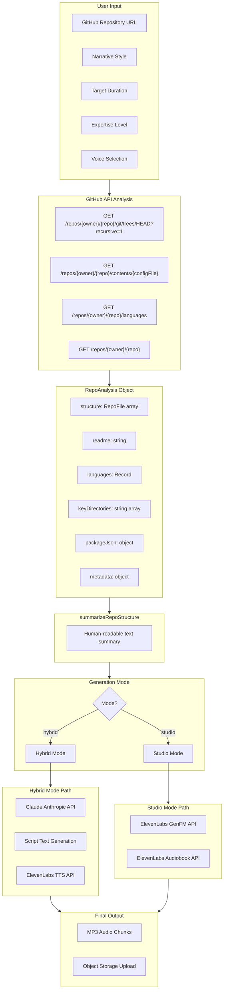
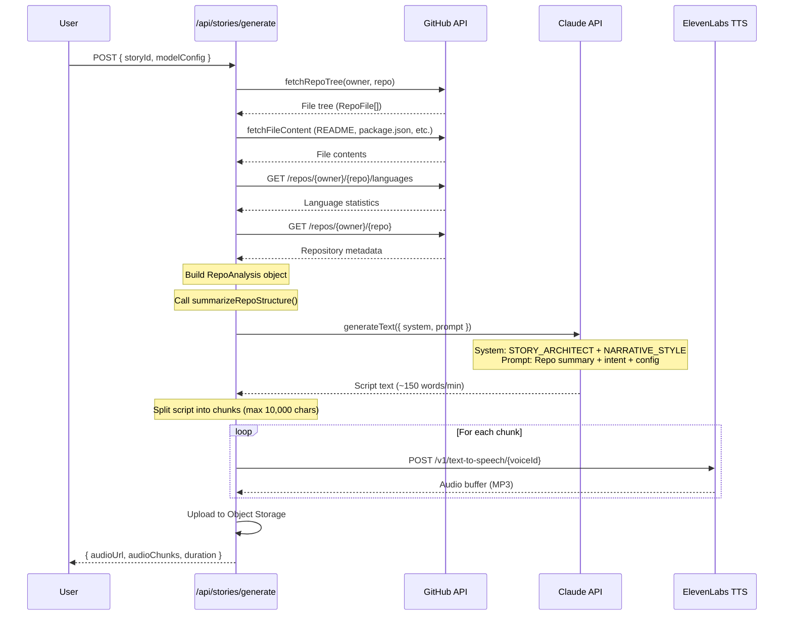
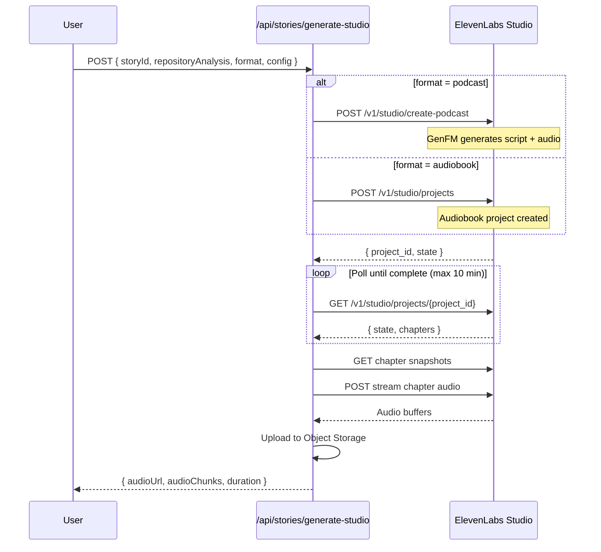
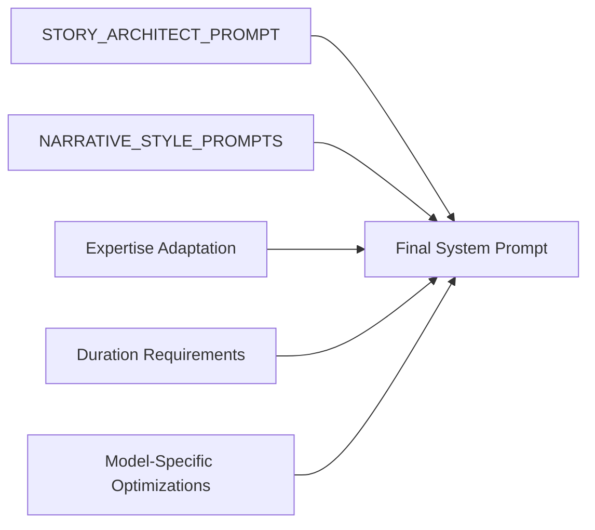

# Repository Analysis Pipeline

This document details exactly what context is sent to Claude and ElevenLabs for script and audio generation in Code Tales.

**Last Updated:** January 2026  
**Source Files Audited:**
- `lib/agents/github.ts`
- `lib/agents/prompts.ts`
- `lib/ai/models.ts`
- `lib/content-generation/framework.ts`
- `app/api/stories/generate/route.ts`
- `app/api/stories/generate-studio/route.ts`
- `lib/generation/elevenlabs-studio.ts`

---

## Table of Contents

1. [High-Level Architecture](#1-high-level-architecture)
2. [Repository Data Extraction](#2-repository-data-extraction)
3. [Claude Context Preparation](#3-claude-context-preparation)
4. [ElevenLabs Context Preparation](#4-elevenlabs-context-preparation)
5. [Token Limits and Truncation Strategies](#5-token-limits-and-truncation-strategies)
6. [Example Payloads](#6-example-payloads)

---

## 1. High-Level Architecture

### Complete Data Flow Diagram



### Hybrid Mode Sequence Diagram



### Studio Mode Sequence Diagram



---

## 2. Repository Data Extraction

### 2.1 GitHub API Calls

The repository analysis is performed by `lib/agents/github.ts`. The following API calls are made:

#### Fetch Repository Tree

**Function:** `fetchRepoTree(owner, repo)`

```
GET https://api.github.com/repos/{owner}/{repo}/git/trees/HEAD?recursive=1
```

**Headers:**
```json
{
  "Accept": "application/vnd.github+json",
  "X-GitHub-Api-Version": "2022-11-28"
}
```

**Returns:** Array of all files/directories in the repository

```typescript
interface RepoFile {
  path: string       // e.g., "src/components/Button.tsx"
  type: "file" | "dir"
  size?: number      // File size in bytes
}
```

#### Fetch File Content

**Function:** `fetchFileContent(owner, repo, path)`

```
GET https://api.github.com/repos/{owner}/{repo}/contents/{path}
```

Content is base64-decoded from the response.

**Files Fetched (in priority order):**
| File | Language/Framework |
|------|-------------------|
| `package.json` | Node.js/JavaScript |
| `go.mod` | Go |
| `Cargo.toml` | Rust |
| `pyproject.toml` | Python |
| `tsconfig.json` | TypeScript |
| `pom.xml` | Java/Maven |
| `build.gradle` | Java/Gradle |
| `Makefile` | C/C++/General |
| `CMakeLists.txt` | CMake |
| `requirements.txt` | Python |
| `setup.py` | Python |
| `Gemfile` | Ruby |

**README Detection Order:**
1. `README.md`
2. `readme.md`
3. `Readme.md`

#### Fetch Language Statistics

```
GET https://api.github.com/repos/{owner}/{repo}/languages
```

**Returns:** Object mapping language names to byte counts

```json
{
  "TypeScript": 245000,
  "JavaScript": 12000,
  "CSS": 8500
}
```

#### Fetch Repository Metadata

```
GET https://api.github.com/repos/{owner}/{repo}
```

**Extracted Fields:**
```typescript
{
  stargazers_count: number
  forks_count: number
  language: string        // Primary language
  description: string
  topics: string[]
}
```

### 2.2 RepoAnalysis Data Structure

**Defined in:** `lib/agents/github.ts`

```typescript
interface RepoAnalysis {
  structure: RepoFile[]                    // All files and directories
  readme: string | null                    // Full README content
  languages: Record<string, number>        // Language byte counts
  mainFiles: string[]                      // Entry point file paths
  keyDirectories: string[]                 // Important top-level dirs
  packageJson: Record<string, unknown> | null  // Parsed config file
  metadata: {
    stargazers_count?: number
    forks_count?: number
    language?: string
    description?: string
    topics?: string[]
  } | null
}
```

### 2.3 Key Directory Filtering

Top-level directories are included, excluding:
- Hidden directories (`.git`, `.github`, `.vscode`, etc.)
- Build artifacts: `node_modules`, `dist`, `build`, `__pycache__`, `vendor`, `target`, `bin`, `obj`

### 2.4 Main File Detection

Entry points identified by filename:
- `index.ts`, `index.js`
- `main.ts`, `main.go`, `main.py`, `main.rs`
- `app.py`, `server.ts`, `server.js`
- `lib.rs`, `mod.rs`
- All config files listed above

---

## 3. Claude Context Preparation

### 3.1 Repository Summary Generation

**Function:** `summarizeRepoStructure(analysis: RepoAnalysis): string`

Converts the structured analysis into human-readable text:

```typescript
function summarizeRepoStructure(analysis: RepoAnalysis): string {
  // Output format:
  `Repository Structure Summary:
- Total files: ${fileCount}
- Total directories: ${dirCount}
- Primary languages: ${topLanguages.join(", ")}  // Top 3 languages
- Key directories: ${keyDirectories.slice(0, 10).join(", ")}
- Stars: ${metadata?.stargazers_count || 0}
- Forks: ${metadata?.forks_count || 0}
- Description: ${metadata?.description || "No description"}
- Key dependencies: ${deps.join(", ")}  // First 10 dependencies

README Preview:
${readme.split("\n\n")[0]?.slice(0, 500) || readme.slice(0, 500)}`
}
```

### 3.2 System Prompt Composition

**Defined in:** `lib/agents/prompts.ts`

The system prompt is composed from multiple parts:



#### Base Story Architect Prompt

```
You are the Story Architect Agent for Code Tales.

Your role is to transform repository analysis into compelling audio stories.

You receive:
1. A story plan with chapters and focus areas
2. Detailed code analysis from the Repository Analyzer
3. User preferences (style, length, expertise level)

You produce:
- Complete story scripts for each chapter
- Natural, engaging prose suitable for audio
- Technical accuracy while remaining accessible

STORY GUIDELINES:
- Write in a natural, conversational tone
- Use transitions between topics
- Include specific code examples and file references
- Vary sentence length for natural rhythm
- Include brief pauses (indicated by "...") for dramatic effect
- Target 150 words per minute of audio
```

#### Narrative Style Prompts

| Style | Core Approach | Key Elements |
|-------|--------------|--------------|
| **fiction** | Code as living world | Characters from components, plot from data flow, conflict from bugs |
| **documentary** | Authoritative analysis | Historical context, metrics, expert insights, comparisons |
| **tutorial** | Progressive education | Foundation → Building → Integration → Mastery → Practice |
| **podcast** | Casual conversation | Senior dev tone, enthusiasm, war stories, tangents |
| **technical** | Expert deep-dive | Implementation details, Big-O, file paths, security analysis |

**Example: Fiction Style Prompt**
```
Transform the code analysis into an immersive fictional narrative...

WORLD-BUILDING RULES:
- The codebase is a living, breathing world with distinct regions (modules/packages)
- Code components are CHARACTERS with rich personalities, motivations, and relationships
- Functions are actions characters take; classes are character types or factions
- Data flows are journeys; API calls are communications between kingdoms
- Bugs are villains; tests are guardians; documentation is ancient lore
- Design patterns are cultural traditions passed down through generations

NARRATIVE STRUCTURE:
- Begin with an atmospheric introduction to the world
- Introduce the main characters (core components) with backstories
- Build tension through conflicts (error handling, edge cases, dependencies)
- Include dialogue between components explaining their interactions
- Use dramatic reveals for architectural decisions
- Create emotional moments around critical code paths
- End with resolution and hints at future adventures (extensibility)
...
```

#### Expertise Level Adaptation

| Level | Adaptation |
|-------|-----------|
| **beginner** | Explain all technical terms using simple analogies. Be patient and thorough. Never assume prior knowledge. |
| **intermediate** | Assume general programming knowledge but explain domain-specific and framework-specific concepts. |
| **expert** | Be technically precise. Skip basic explanations. Focus on implementation details, edge cases, and nuances. |

#### Duration Requirements

```
DURATION REQUIREMENT: This narrative MUST be comprehensive enough for ${targetMinutes} minutes 
of audio (~${targetWords} words).
- Do NOT summarize or abbreviate - explore every significant aspect in detail
- Include rich descriptions, multiple examples, and thorough explanations
- If the style is fiction, include full character development, world-building, and plot arcs
- Cover ALL major components, not just the highlights
- Use the full allocated time to create an immersive, complete experience
```

### 3.3 Complete Prompt Sent to Claude

**From:** `app/api/stories/generate/route.ts` (lines 351-380)

```typescript
const result = await generateText({
  model: anthropic(modelName),
  system: systemPrompt,  // Composed as described above
  prompt: `Create an audio narrative script for the repository ${owner}/${repo}.

NARRATIVE STYLE: ${narrativeStyle.toUpperCase()}
TARGET DURATION: ${targetMinutes} minutes (~${targetWords} words)
USER'S INTENT: ${storyTitle}
${intentContext}

REPOSITORY ANALYSIS:
${repoSummary}

KEY DIRECTORIES TO COVER:
${keyDirectories.slice(0, 15).join("\n")}

CRITICAL INSTRUCTIONS:
1. You MUST generate approximately ${targetWords} words - this is a ${targetMinutes}-minute audio experience
2. Style is "${narrativeStyle}" - fully commit to this style throughout
3. ${narrativeStyle === "fiction" ? "Create a complete fictional world with characters, plot, conflict, and resolution. Code components ARE your characters." : ""}
4. Cover ALL major aspects of the codebase - do not rush or summarize
5. Include natural pauses (...) for dramatic effect and breathing
6. Organize into clear sections with smooth transitions
7. Do NOT include any markdown headers or formatting - just natural prose with paragraph breaks
8. Make it engaging enough that someone would want to listen for the full ${targetMinutes} minutes

BEGIN YOUR ${targetMinutes}-MINUTE ${narrativeStyle.toUpperCase()} NARRATIVE NOW:`,
  maxOutputTokens: modelConfigData.maxTokens,
  temperature: modelConfigData.temperature,
})
```

### 3.4 Intent Context (Optional Enhancement)

If the story has an associated intent from the chat agent:

```typescript
intentContext = `
USER'S LEARNING GOAL: ${intent.userDescription || "General exploration"}
FOCUS AREAS: ${(intent.focusAreas as string[])?.join(", ") || "All areas"}
INTENT TYPE: ${intent.intentCategory || "general"}`
```

**Intent Categories:**
- `architecture_understanding`
- `onboarding_deep_dive`
- `specific_feature_focus`
- `code_review_prep`
- `learning_patterns`
- `api_documentation`
- `bug_investigation`
- `migration_planning`

---

## 4. ElevenLabs Context Preparation

### 4.1 Hybrid Mode (Claude Script → ElevenLabs TTS)

In hybrid mode, Claude generates the script, then ElevenLabs synthesizes audio chunk by chunk.

#### TTS API Call

**Endpoint:**
```
POST https://api.elevenlabs.io/v1/text-to-speech/{voiceId}?output_format=mp3_44100_128
```

**Headers:**
```json
{
  "xi-api-key": "${ELEVENLABS_API_KEY}",
  "Content-Type": "application/json"
}
```

**Request Body:**
```typescript
{
  text: string,                    // Script chunk (max ~10,000 chars)
  model_id: "eleven_flash_v2_5",   // TTS model
  voice_settings: {
    stability: 0.35 | 0.5,         // 0.35 for fiction (more expressive), 0.5 for others
    similarity_boost: 0.8,         // High for consistent voice
    style: 0 | 0.15,               // 0.15 for fiction (slight exaggeration), 0 for others
    use_speaker_boost: true        // Better voice matching
  },
  previous_text?: string,          // Last 1000 chars of previous chunk (for continuity)
  next_text?: string,              // First 500 chars of next chunk (for continuity)
  apply_text_normalization: "auto" // Proper pronunciation
}
```

**Response:** MP3 audio buffer

### 4.2 Studio Mode - GenFM Podcast

For podcast-style generation, ElevenLabs GenFM creates both script and audio.

**Endpoint:**
```
POST https://api.elevenlabs.io/v1/studio/create-podcast
```

**Request Body (GenFMPodcastRequest):**
```typescript
{
  model_id: "eleven_flash_v2_5",
  mode: {
    type: "conversation" | "bulletin",  // conversation = host+guest, bulletin = single host
    host_voice_id: string,
    guest_voice_id?: string             // Only for "conversation" mode
  },
  source: {
    type: "text",
    content: string                     // Repository analysis summary
  },
  quality_preset: "standard" | "high" | "ultra" | "ultra_lossless",
  duration_scale: "short" | "default" | "long",
  language: string,                     // e.g., "en"
  intro?: string,
  outro?: string,
  instructions_prompt?: string,         // Custom generation instructions
  callback_url?: string,                // Webhook for completion notification
  apply_text_normalization: "auto"
}
```

**Response:**
```typescript
{
  project: {
    project_id: string,
    name: string,
    state: "converting" | "default" | "ready" | "completed",
    created_at: string,
    chapters?: StudioChapter[],
    can_be_downloaded?: boolean
  }
}
```

### 4.3 Studio Mode - Audiobook Project

For audiobook-style generation with structured chapters.

**Endpoint:**
```
POST https://api.elevenlabs.io/v1/studio/projects
```

**Request Body (AudiobookProjectRequest):**
```typescript
{
  name: string,                          // Story title
  from_content: string,                  // Repository analysis as source content
  default_paragraph_voice_id: string,    // Main narrator voice
  default_title_voice_id: string,        // Same as paragraph voice
  default_model_id: "eleven_multilingual_v2",
  quality_preset: "standard" | "high" | "ultra" | "ultra_lossless",
  language: string,                      // e.g., "en"
  fiction: true,
  volume_normalization: true,
  callback_url?: string                  // Webhook for completion notification
}
```

### 4.4 Voice Configurations

**Recommended Voice Pairs (from `lib/generation/elevenlabs-studio.ts`):**

| Style | Host Voice | Guest Voice | Description |
|-------|-----------|-------------|-------------|
| tech_podcast | Rachel (21m00Tcm4TlvDq8ikWAM) | Domi (AZnzlk1XvdvUeBnXmlld) | Professional tech discussion |
| documentary | Antoni (ErXwobaYiN019PkySvjV) | Josh (TxGEqnHWrfWFTfGW9XjX) | Documentary-style narration |
| casual_chat | Adam (pNInz6obpgDQGcFmaJgB) | Bella (EXAVITQu4vr4xnSDxMaL) | Casual, friendly conversation |
| educational | Sam (yoZ06aMxZJJ28mfd3POQ) | Rachel (21m00Tcm4TlvDq8ikWAM) | Expert educational tone |

**Default Voice Presets by Narrative Style (from `lib/generation/modes.ts`):**

| Style | Voice ID | Role |
|-------|----------|------|
| podcast | 21m00Tcm4TlvDq8ikWAM + AZnzlk1XvdvUeBnXmlld | Host + Guest |
| documentary | ErXwobaYiN019PkySvjV | Narrator |
| fiction | EXAVITQu4vr4xnSDxMaL | Narrator |
| tutorial | pNInz6obpgDQGcFmaJgB | Narrator |
| technical | yoZ06aMxZJJ28mfd3POQ | Narrator |

### 4.5 Quality and Duration Presets

**Quality Presets:**

| Preset | Bitrate | Sample Rate | Cost Multiplier |
|--------|---------|-------------|-----------------|
| standard | 128kbps | 44.1kHz | 1x |
| high | 192kbps | 44.1kHz | 1.2x |
| ultra | 192kbps | 44.1kHz | 1.5x |
| ultra_lossless | 705.6kbps | 44.1kHz | 2x |

**Duration Presets:**

| Preset | Description | Typical Length |
|--------|-------------|----------------|
| short | Quick overview | Under 3 minutes |
| default | Balanced coverage | 3-7 minutes |
| long | Detailed exploration | 7+ minutes |

---

## 5. Token Limits and Truncation Strategies

### 5.1 AI Model Token Limits

**From:** `lib/ai/models.ts`

| Model | Context Window | Max Output Tokens | Available |
|-------|---------------|-------------------|-----------|
| Claude Sonnet 4 | 200,000 | 64,000 | ✅ Yes |
| Claude 3.5 Haiku | 200,000 | 8,192 | ✅ Yes |
| GPT-4o | 128,000 | 16,384 | ❌ No |
| GPT-4o Mini | 128,000 | 16,384 | ❌ No |
| OpenAI o1 | 200,000 | 100,000 | ❌ No |
| Gemini 2.0 Flash | 1,000,000 | 8,192 | ❌ No |
| Llama 3.3 70B (Groq) | 128,000 | 32,768 | ❌ No |

### 5.2 Output Token Calculation

**From:** `lib/ai/models.ts` - `getModelConfiguration()`

```typescript
const targetWords = targetDurationMinutes * 150  // 150 words per minute
const estimatedTokens = Math.ceil(targetWords / 0.75) + 2000  // ~1.33 tokens per word + buffer
const maxTokens = Math.min(estimatedTokens, model.maxOutputTokens)
```

**Example Calculations:**

| Duration | Target Words | Estimated Tokens | Claude Sonnet 4 | Claude Haiku |
|----------|-------------|------------------|-----------------|--------------|
| 5 min | 750 | 3,000 | 3,000 | 3,000 |
| 15 min | 2,250 | 5,000 | 5,000 | 5,000 |
| 30 min | 4,500 | 8,000 | 8,000 | 8,000 |
| 60 min | 9,000 | 14,000 | 14,000 | **8,192** (capped) |

### 5.3 Script Chunking for TTS

**From:** `app/api/stories/generate/route.ts` - `splitTextIntoChunks()`

**Max Chunk Size:** 10,000 characters (adjustable, default 4,000 for safety)

**Chunking Priority:**
1. Split on paragraph breaks (`\n\n`) if found after 50% of max size
2. Fall back to sentence boundaries (`. `, `? `, `! `, `... `)
3. Fall back to word boundaries (` `)
4. Hard cut at max size if no boundaries found

```typescript
function splitTextIntoChunks(text: string, maxChars = 4000): string[] {
  // Priority:
  // 1. Paragraph breaks (\n\n) after 50% of max
  // 2. Sentence endings (. ? ! ...) after 30% of max
  // 3. Word boundaries (space)
  // 4. Hard cut at maxChars
}
```

### 5.4 Context Window Management

**Input Token Estimation:**

The system does not explicitly truncate input, but the repository summary is naturally limited by:

1. **README Preview:** First paragraph or first 500 characters
2. **Key Directories:** Limited to first 15 directories
3. **Dependencies:** Limited to first 10 dependencies
4. **Languages:** Top 3 languages only

**Practical Input Size:**
- Repository summary: ~500-2,000 tokens
- System prompt: ~500-1,500 tokens (varies by style)
- User prompt: ~200-500 tokens
- **Total Input:** ~1,200-4,000 tokens (well under context limits)

### 5.5 Timeout Handling

**From:** `app/api/stories/generate/route.ts`

```typescript
export const maxDuration = 300  // 5 minutes max (Vercel limit)
const TIMEOUT_WARNING_MS = 240000  // 4 minutes - warn before cutoff

// During TTS generation:
if (chunkElapsed > 270000) {  // 4.5 minutes
  // Save partial progress and return early
}
```

---

## 6. Example Payloads

### 6.1 RepoAnalysis Object Example

```typescript
{
  structure: [
    { path: "package.json", type: "file", size: 1234 },
    { path: "src", type: "dir" },
    { path: "src/index.ts", type: "file", size: 5678 },
    { path: "src/components", type: "dir" },
    { path: "src/components/Button.tsx", type: "file", size: 2345 },
    // ... more files
  ],
  readme: "# My Awesome Project\n\nA React component library for building modern web applications.\n\n## Installation\n\n```bash\nnpm install my-awesome-project\n```\n\n...",
  languages: {
    "TypeScript": 245000,
    "JavaScript": 12000,
    "CSS": 8500,
    "HTML": 2000
  },
  mainFiles: [
    "src/index.ts",
    "package.json",
    "tsconfig.json"
  ],
  keyDirectories: [
    "src",
    "lib",
    "components",
    "hooks",
    "utils"
  ],
  packageJson: {
    "name": "my-awesome-project",
    "version": "1.0.0",
    "dependencies": {
      "react": "^18.2.0",
      "react-dom": "^18.2.0",
      "tailwindcss": "^3.4.0"
    }
  },
  metadata: {
    stargazers_count: 1250,
    forks_count: 89,
    language: "TypeScript",
    description: "A React component library for building modern web applications",
    topics: ["react", "components", "ui", "typescript"]
  }
}
```

### 6.2 Repository Summary Example

```
Repository Structure Summary:
- Total files: 156
- Total directories: 24
- Primary languages: TypeScript, JavaScript, CSS
- Key directories: src, lib, components, hooks, utils
- Stars: 1250
- Forks: 89
- Description: A React component library for building modern web applications
- Key dependencies: react, react-dom, tailwindcss, framer-motion, zod

README Preview:
# My Awesome Project

A React component library for building modern web applications.

## Installation

```bash
npm install my-awesome-project
```
```

### 6.3 Complete Claude API Request Example

```typescript
{
  model: "claude-sonnet-4-20250514",
  system: `You are the Story Architect Agent for Code Tales.

Your role is to transform repository analysis into compelling audio stories.
...
STYLE:
Transform the code analysis into an immersive fictional narrative...

WORLD-BUILDING RULES:
- The codebase is a living, breathing world with distinct regions (modules/packages)
- Code components are CHARACTERS with rich personalities, motivations, and relationships
...

EXPERTISE ADAPTATION: Assume general programming knowledge but explain domain-specific and framework-specific concepts.

DURATION REQUIREMENT: This narrative MUST be comprehensive enough for 15 minutes of audio (~2250 words).
...

CLAUDE-SPECIFIC GUIDELINES:
- Use your full creative and analytical capabilities
- Leverage your extended context window for comprehensive coverage
- Be precise with technical details while maintaining engagement`,

  prompt: `Create an audio narrative script for the repository example-org/my-awesome-project.

NARRATIVE STYLE: FICTION
TARGET DURATION: 15 minutes (~2250 words)
USER'S INTENT: Understanding the React Component Architecture

USER'S LEARNING GOAL: I want to understand how the components work together
FOCUS AREAS: Components, Hooks, State Management
INTENT TYPE: architecture_understanding

REPOSITORY ANALYSIS:
Repository Structure Summary:
- Total files: 156
- Total directories: 24
- Primary languages: TypeScript, JavaScript, CSS
- Key directories: src, lib, components, hooks, utils
- Stars: 1250
- Forks: 89
- Description: A React component library for building modern web applications
- Key dependencies: react, react-dom, tailwindcss, framer-motion, zod

README Preview:
# My Awesome Project
A React component library for building modern web applications...

KEY DIRECTORIES TO COVER:
src
lib
components
hooks
utils
types
styles

CRITICAL INSTRUCTIONS:
1. You MUST generate approximately 2250 words - this is a 15-minute audio experience
2. Style is "fiction" - fully commit to this style throughout
3. Create a complete fictional world with characters, plot, conflict, and resolution. Code components ARE your characters.
4. Cover ALL major aspects of the codebase - do not rush or summarize
5. Include natural pauses (...) for dramatic effect and breathing
6. Organize into clear sections with smooth transitions
7. Do NOT include any markdown headers or formatting - just natural prose with paragraph breaks
8. Make it engaging enough that someone would want to listen for the full 15 minutes

BEGIN YOUR 15-MINUTE FICTION NARRATIVE NOW:`,

  maxOutputTokens: 5000,
  temperature: 0.8
}
```

### 6.4 ElevenLabs TTS Request Example (Hybrid Mode)

```typescript
// POST https://api.elevenlabs.io/v1/text-to-speech/EXAVITQu4vr4xnSDxMaL?output_format=mp3_44100_128
{
  text: "Deep in the silicon valleys of the React realm, where components bloomed like digital flowers, there lived a wise and ancient guardian named 'Button'...",
  model_id: "eleven_flash_v2_5",
  voice_settings: {
    stability: 0.35,
    similarity_boost: 0.8,
    style: 0.15,
    use_speaker_boost: true
  },
  previous_text: undefined,  // First chunk
  next_text: "But Button was not alone in this vast kingdom. Nearby, in the shadowy depths of the hooks folder, dwelt the mysterious useAuth...",
  apply_text_normalization: "auto"
}
```

### 6.5 ElevenLabs GenFM Request Example (Studio Mode)

```typescript
// POST https://api.elevenlabs.io/v1/studio/create-podcast
{
  model_id: "eleven_flash_v2_5",
  mode: {
    type: "conversation",
    host_voice_id: "21m00Tcm4TlvDq8ikWAM",  // Rachel
    guest_voice_id: "AZnzlk1XvdvUeBnXmlld"   // Domi
  },
  source: {
    type: "text",
    content: "Repository Structure Summary:\n- Total files: 156\n- Total directories: 24\n- Primary languages: TypeScript, JavaScript, CSS\n- Key directories: src, lib, components, hooks, utils\n- Stars: 1250\n- Forks: 89\n- Description: A React component library for building modern web applications\n- Key dependencies: react, react-dom, tailwindcss, framer-motion, zod\n\nREADME Preview:\n# My Awesome Project\nA React component library for building modern web applications..."
  },
  quality_preset: "high",
  duration_scale: "default",
  language: "en",
  instructions_prompt: "Create an engaging technical podcast discussing this React component library. Focus on the architecture, key components, and design decisions.",
  callback_url: "https://example.replit.dev/api/webhooks/elevenlabs",
  apply_text_normalization: "auto"
}
```

### 6.6 ElevenLabs Audiobook Request Example (Studio Mode)

```typescript
// POST https://api.elevenlabs.io/v1/studio/projects
{
  name: "Understanding the React Component Architecture",
  from_content: "Repository Structure Summary:\n- Total files: 156\n- Total directories: 24\n...",
  default_paragraph_voice_id: "EXAVITQu4vr4xnSDxMaL",  // Bella
  default_title_voice_id: "EXAVITQu4vr4xnSDxMaL",
  default_model_id: "eleven_multilingual_v2",
  quality_preset: "high",
  language: "en",
  fiction: true,
  volume_normalization: true,
  callback_url: "https://example.replit.dev/api/webhooks/elevenlabs"
}
```

---

## Appendix: Content Generation Framework

For advanced use cases, the `ContentGenerationFramework` class in `lib/content-generation/framework.ts` provides:

- Style mixing (e.g., 70% fiction + 30% documentary)
- Secondary style overlays (dramatic, humorous, suspenseful, etc.)
- Content format options (narrative, dialogue, monologue, interview, lecture)
- Pacing control (fast, moderate, slow, variable)
- Tone intensity settings (subtle, moderate, intense)
- Prompt validation with warnings and suggestions

This framework generates more sophisticated prompts for complex content requirements beyond the basic narrative styles.
