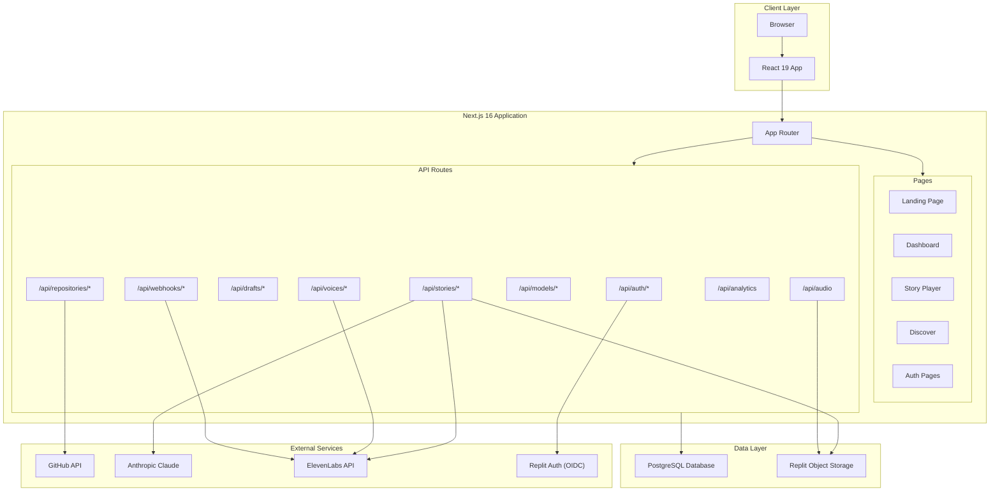
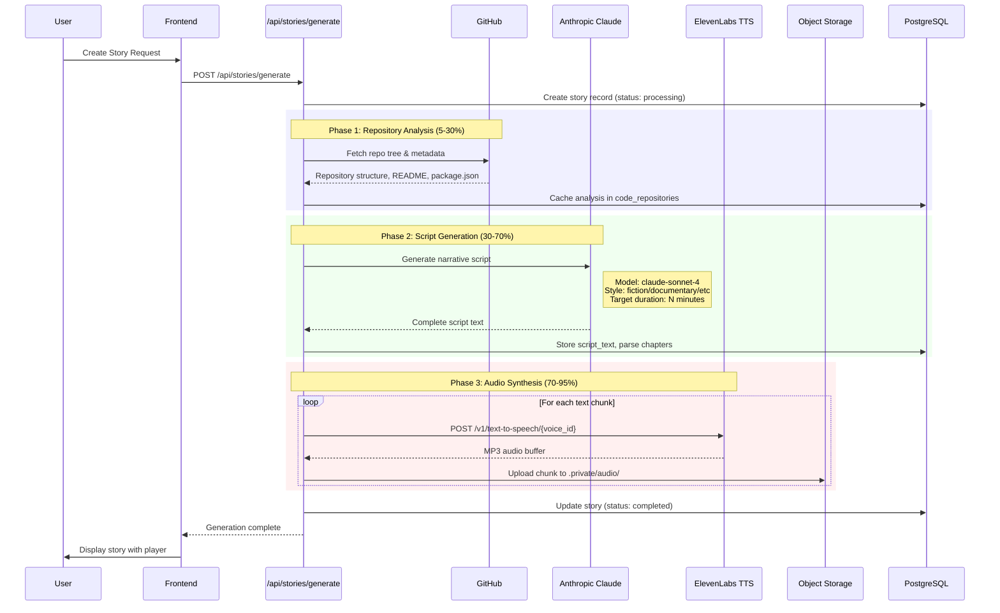
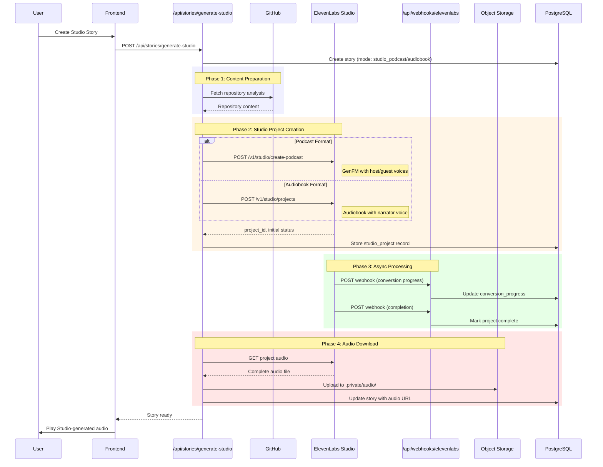
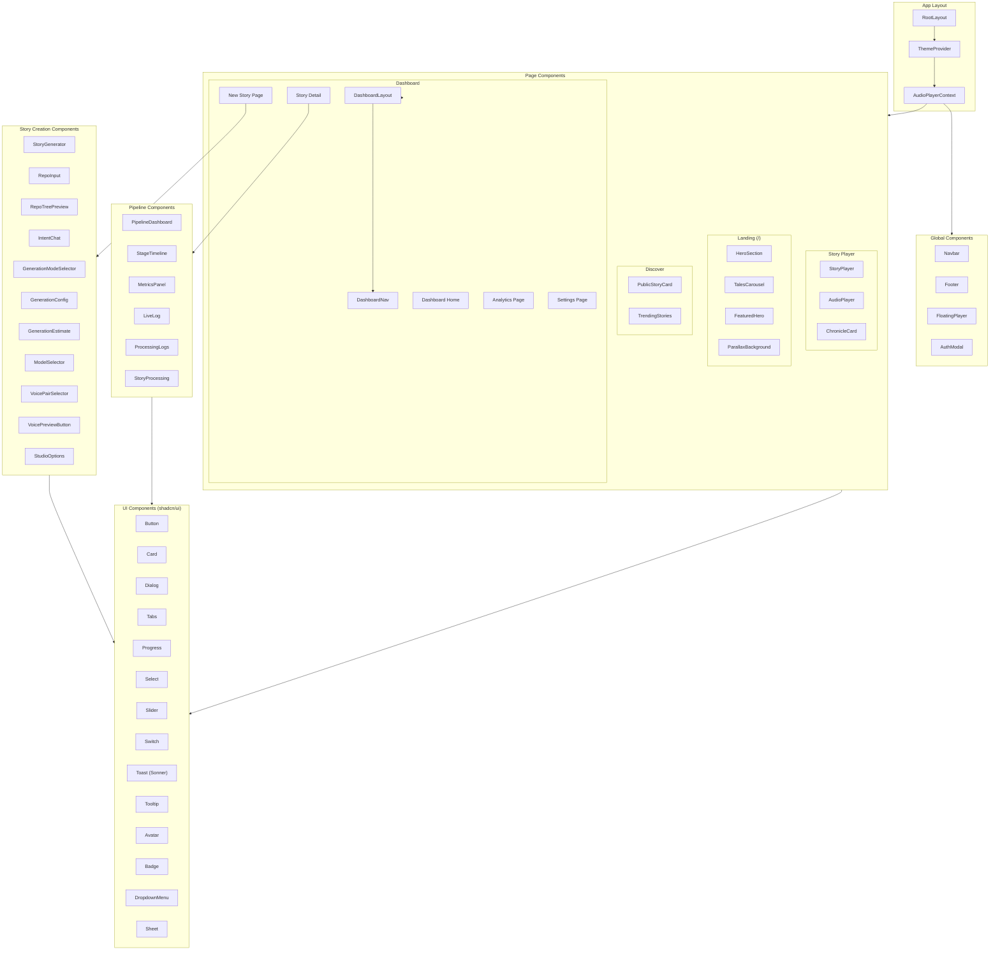
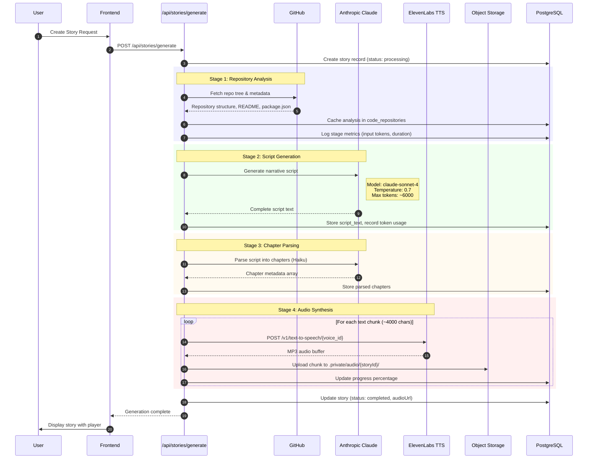
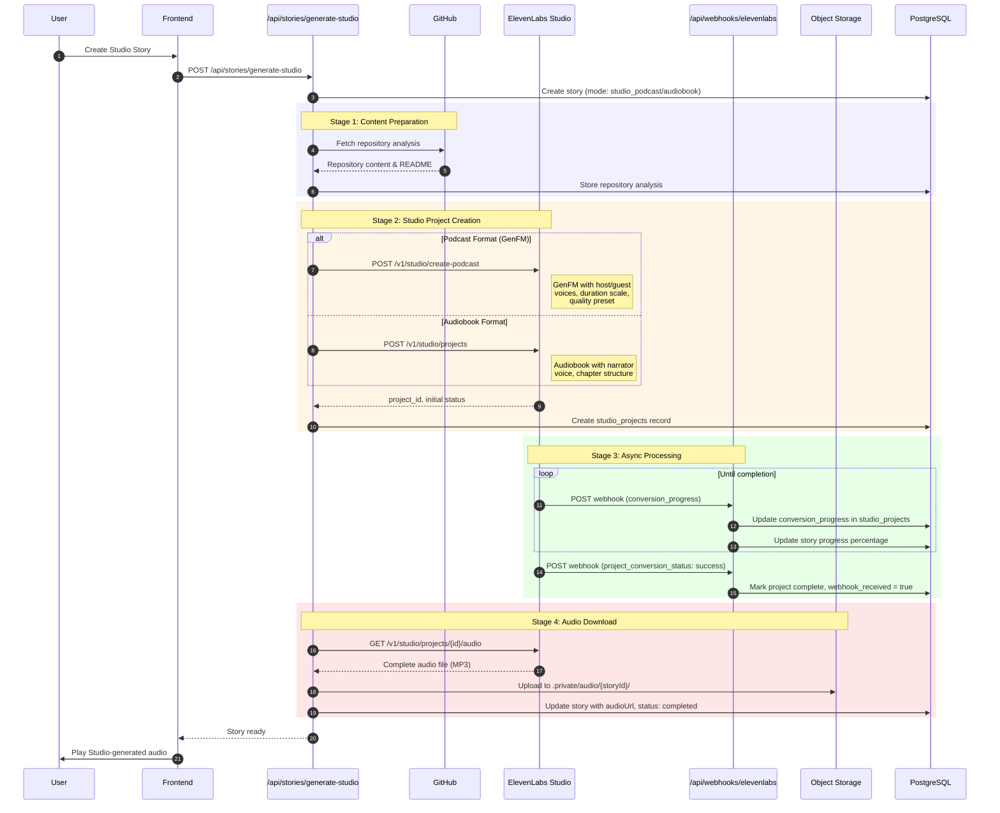
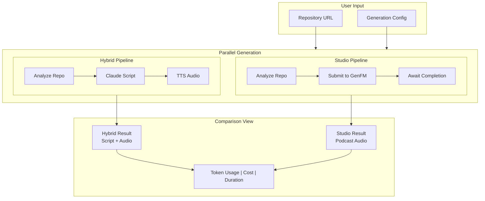
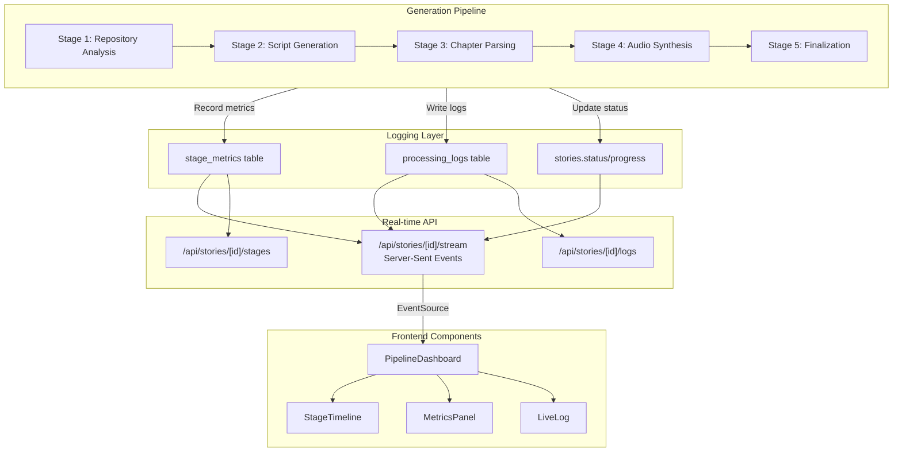
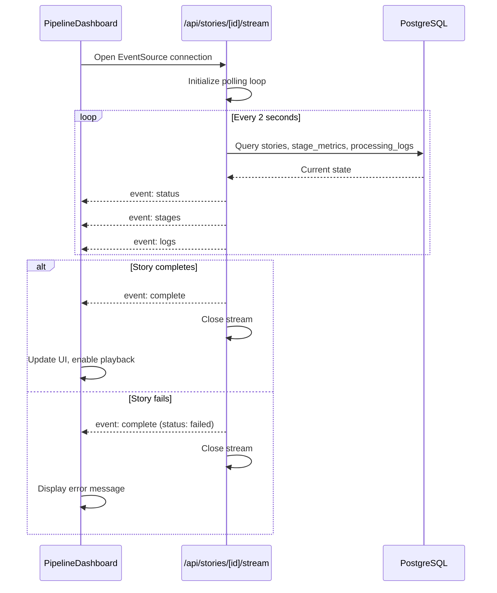

# Code Tales: System Architecture

**Version:** 3.1  
**Last Updated:** January 12, 2026

---

## Table of Contents

1. [System Overview](#system-overview)
2. [Technology Stack](#technology-stack)
3. [Architecture Diagrams](#architecture-diagrams)
4. [Component Architecture](#component-architecture)
5. [Generation Modes](#generation-modes)
6. [Pipeline Visibility System](#pipeline-visibility-system)
7. [API Endpoints Catalog](#api-endpoints-catalog)
8. [Database Schema](#database-schema)
9. [Integration Points](#integration-points)

---

## System Overview

Code Tales is an innovative platform that transforms GitHub repositories into immersive audio stories using advanced AI. The platform bridges the gap between complex codebases and auditory learning by:

- **Analyzing Code Repositories**: Fetching and parsing GitHub repositories to understand project structure, dependencies, and architecture patterns
- **Generating Narrative Scripts**: Using Anthropic Claude to create engaging, educational narratives in various styles (fiction, documentary, tutorial, podcast, technical)
- **Synthesizing Audio**: Converting scripts to high-quality audio using ElevenLabs TTS with support for multiple voices and quality presets
- **Providing Interactive Experiences**: Offering a modern web interface with chapter navigation, progress tracking, and comparison between generation modes

The platform supports two primary generation pipelines:
- **Hybrid Mode**: Full control with Claude script generation + ElevenLabs TTS
- **Studio Mode**: ElevenLabs GenFM podcasts or Audiobook projects for multi-voice narration

---

## Technology Stack

| Layer | Technology | Version/Details |
|-------|------------|-----------------|
| **Framework** | Next.js | 16 (App Router) |
| **UI Library** | React | 19 |
| **Language** | TypeScript | Strict mode enabled |
| **Styling** | Tailwind CSS | 4 |
| **UI Components** | shadcn/ui | Radix primitives |
| **Database ORM** | Drizzle ORM | Type-safe queries |
| **Database** | PostgreSQL | Replit Neon-backed |
| **Authentication** | Replit Auth | OpenID Connect |
| **AI Provider** | Anthropic Claude | claude-sonnet-4-20250514, claude-3-5-haiku |
| **Audio Synthesis** | ElevenLabs | TTS, GenFM, Audiobook APIs |
| **Object Storage** | Replit Object Storage | Private audio file storage |
| **Package Manager** | npm/pnpm | Node.js 20+ |

### Key Dependencies

```
@ai-sdk/anthropic     - Anthropic AI SDK for script generation
@ai-sdk/react         - React hooks for AI streaming
drizzle-orm           - Type-safe database ORM
framer-motion         - Animations and transitions
lucide-react          - Icon library
react-markdown        - Markdown rendering
sonner                - Toast notifications
```

---

## Architecture Diagrams

### System Component Diagram



### Hybrid Mode Data Flow



### Studio Mode Data Flow



### Database Schema Relationships

```mermaid
erDiagram
    users ||--o{ stories : creates
    users ||--o{ code_repositories : owns
    users ||--o{ story_intents : creates
    users ||--o{ story_drafts : saves
    users ||--o{ auth_sessions : has
    
    code_repositories ||--o{ stories : source_for
    code_repositories ||--o{ story_intents : analyzes
    
    story_intents ||--o| stories : generates
    
    stories ||--o{ story_chapters : contains
    stories ||--o{ processing_logs : logs
    stories ||--o{ stage_metrics : tracks
    stories ||--o| studio_projects : uses

    users {
        varchar id PK
        varchar email UK
        varchar first_name
        varchar last_name
        varchar profile_image_url
        varchar subscription_tier
        jsonb preferences
        jsonb usage_quota
        integer stories_used_this_month
        integer minutes_used_this_month
        timestamp created_at
        timestamp updated_at
    }

    stories {
        uuid id PK
        varchar user_id FK
        uuid intent_id FK
        uuid repository_id FK
        text title
        text narrative_style
        text voice_id
        integer target_duration_minutes
        integer actual_duration_seconds
        text expertise_level
        text script_text
        text audio_url
        jsonb audio_chunks
        jsonb chapters
        text status
        integer progress
        text progress_message
        timestamp processing_started_at
        timestamp processing_completed_at
        text error_message
        boolean is_public
        text share_id UK
        integer play_count
        timestamp last_played_at
        integer last_played_position
        text generation_mode
        jsonb model_config
        timestamp created_at
        timestamp updated_at
    }

    code_repositories {
        uuid id PK
        varchar user_id FK
        text repo_url
        text repo_name
        text repo_owner
        text primary_language
        integer stars_count
        text description
        jsonb analysis_cache
        timestamp analysis_cached_at
        timestamp created_at
    }

    story_intents {
        uuid id PK
        varchar user_id FK
        uuid repository_id FK
        text intent_category
        text user_description
        jsonb focus_areas
        text expertise_level
        jsonb conversation_history
        jsonb generated_plan
        timestamp created_at
    }

    story_drafts {
        uuid id PK
        varchar user_id FK
        text repository_url
        text repository_name
        text repository_owner
        text repository_description
        text repository_language
        integer repository_stars
        jsonb style_config
        jsonb model_config
        jsonb voice_config
        timestamp scheduled_at
        timestamp created_at
        timestamp updated_at
    }

    story_chapters {
        uuid id PK
        uuid story_id FK
        integer chapter_number
        text title
        integer start_time_seconds
        integer duration_seconds
        text script_segment
        text audio_url
        jsonb focus_files
        jsonb key_concepts
        timestamp created_at
    }

    processing_logs {
        uuid id PK
        uuid story_id FK
        timestamp timestamp
        text agent_name
        text action
        jsonb details
        text level
    }

    stage_metrics {
        uuid id PK
        uuid story_id FK
        text stage_name
        integer stage_order
        timestamp started_at
        timestamp ended_at
        integer duration_ms
        text status
        integer input_tokens
        integer output_tokens
        text cost_estimate
        text prompt_used
        text response_preview
        jsonb metadata
        timestamp created_at
    }

    studio_projects {
        uuid id PK
        uuid story_id FK
        text elevenlabs_project_id
        text project_type
        text status
        integer conversion_progress
        boolean webhook_received
        jsonb metadata
        timestamp created_at
        timestamp updated_at
    }

    auth_sessions {
        varchar id PK
        varchar user_id FK
        timestamp expires_at
        timestamp created_at
    }

    sessions {
        varchar sid PK
        jsonb sess
        timestamp expire
    }
```



---

## Component Architecture

### Frontend Components Hierarchy



### Key Component Descriptions

| Component | Purpose |
|-----------|---------|
| **StoryGenerator** | Main orchestrator for story creation flow |
| **IntentChat** | Conversational interface for capturing user intent |
| **GenerationModeSelector** | Toggle between Hybrid and Studio modes |
| **PipelineDashboard** | Real-time visualization of generation stages |
| **StageTimeline** | Visual progress through pipeline phases |
| **StoryPlayer** | Full audio playback with chapters and controls |
| **FloatingPlayer** | Persistent mini-player across pages |
| **ComparisonView** | Side-by-side comparison of generation modes |

---

## Generation Modes

Code Tales supports two primary generation pipelines, each with distinct characteristics and use cases.

### Mode Comparison

| Aspect | Hybrid Mode | Studio Mode |
|--------|-------------|-------------|
| **Script Generation** | Claude AI (claude-sonnet-4) | ElevenLabs (internal) |
| **Audio Synthesis** | ElevenLabs TTS API | ElevenLabs GenFM/Audiobook |
| **Script Control** | Full user control | Auto-generated |
| **Voice Options** | Single narrator | Multi-voice (host/guest) |
| **Processing Model** | Synchronous | Async with webhooks |
| **Best For** | Custom narratives, tutorials | Podcasts, conversations |

### Hybrid Mode (Claude + ElevenLabs TTS)

In Hybrid mode, the platform maintains full control over script generation using Anthropic Claude, then synthesizes audio using ElevenLabs text-to-speech.

**Pipeline Stages:**
1. **Repository Analysis** (0-20%) - Fetch and parse GitHub repository structure
2. **Script Generation** (20-70%) - Claude generates narrative based on analysis
3. **Chapter Parsing** (70-75%) - Extract chapters and structure from script
4. **Audio Synthesis** (75-95%) - ElevenLabs TTS converts text chunks to audio
5. **Finalization** (95-100%) - Merge chunks, update database, notify user



### Studio Mode (ElevenLabs GenFM/Audiobook)

In Studio mode, ElevenLabs handles both script generation and audio synthesis using their GenFM (podcast) or Audiobook APIs. This enables multi-voice conversations and professional-grade productions.

**Formats:**
- **GenFM Podcast**: Conversational format with host/guest voices
- **Audiobook**: Professional narrator with chapter structure

**Pipeline Stages:**
1. **Repository Analysis** (0-15%) - Prepare content from GitHub repo
2. **Studio Project Creation** (15-25%) - Submit to ElevenLabs Studio API
3. **Async Processing** (25-90%) - ElevenLabs generates script and audio
4. **Webhook Callbacks** - Receive progress updates via webhook
5. **Audio Download** (90-100%) - Fetch and store completed audio



### Comparison Mode

Comparison mode runs both Hybrid and Studio pipelines in parallel, allowing users to evaluate and compare the results side-by-side.



---

## Pipeline Visibility System

The Pipeline Visibility System provides real-time progress tracking for story generation, enabling users to monitor each stage of the pipeline as it executes.

### Architecture Overview



### Server-Sent Events (SSE) Stream

The real-time updates are delivered via SSE from `/api/stories/[id]/stream`. The stream polls the database every 2 seconds and emits the following event types:

| Event | Data | Description |
|-------|------|-------------|
| `status` | `{storyId, status, progress, progressMessage, generationMode, processingStartedAt, errorMessage}` | Current story status and progress |
| `stages` | `[{stageName, stageOrder, status, durationMs, inputTokens, outputTokens, costEstimate, promptUsed, responsePreview}]` | All pipeline stage metrics |
| `logs` | `[{timestamp, agentName, action, level, details}]` | Recent processing log entries (last 20) |
| `complete` | `{status, audioUrl, audioChunks, actualDurationSeconds}` | Final completion notification |
| `error` | `{message}` | Error information |

### SSE Connection Sequence



### Stage Metrics Tracking

Each pipeline stage records detailed metrics for observability:

```typescript
interface StageMetric {
  stageName: string       // "repo_analysis", "script_generation", etc.
  stageOrder: number      // Execution order (1, 2, 3...)
  status: "pending" | "running" | "completed" | "failed"
  startedAt: timestamp    // When stage began
  endedAt: timestamp      // When stage finished
  durationMs: number      // Total execution time
  inputTokens: number     // AI input tokens (for Claude stages)
  outputTokens: number    // AI output tokens
  costEstimate: string    // Estimated cost ("$0.0234")
  promptUsed: string      // First 500 chars of prompt
  responsePreview: string // First 500 chars of response
  metadata: object        // Stage-specific data
}
```

### Frontend Components

#### PipelineDashboard
The main orchestrator component that manages SSE connection and distributes data to child components.

```typescript
// Key functionality
- Establishes EventSource connection to /api/stories/[id]/stream
- Parses incoming SSE events and updates state
- Calculates aggregate metrics (total tokens, cost, duration)
- Manages connection lifecycle (reconnection on error)
```

#### StageTimeline
Visual timeline showing each pipeline stage with status indicators.

| Visual State | Meaning |
|--------------|---------|
| ⏳ Gray circle | Pending - not yet started |
| 🔄 Spinning blue | Running - currently executing |
| ✅ Green check | Completed successfully |
| ❌ Red X | Failed with error |

#### MetricsPanel
Displays aggregate statistics:
- Total input/output tokens
- Estimated cost breakdown
- Total processing duration
- Tokens per second throughput

#### LiveLog
Real-time scrolling log viewer:
- Color-coded by level (info, warning, error, success)
- Shows agent name, action, timestamp
- Expandable details for each entry
- Auto-scrolls to newest entries

### Log Levels

| Level | Color | Usage |
|-------|-------|-------|
| `info` | Blue | Normal progress updates |
| `success` | Green | Stage completions, milestones |
| `warning` | Yellow | Non-fatal issues, retries |
| `error` | Red | Failures, exceptions |

### Agent Names

| Agent | Responsibility |
|-------|----------------|
| `System` | Pipeline orchestration, lifecycle events |
| `RepoAnalyzer` | GitHub API interactions, file parsing |
| `Narrator` | Claude script generation |
| `ChapterParser` | Script structure extraction |
| `Synthesizer` | ElevenLabs TTS processing |
| `StudioGenerator` | ElevenLabs Studio API interactions |

---

## API Endpoints Catalog

### Authentication (`/api/auth/*`)

| Endpoint | Method | Purpose |
|----------|--------|---------|
| `/api/auth/login` | GET | Initiates Replit OAuth flow, redirects to authorization |
| `/api/auth/callback` | GET | Handles OAuth callback, creates session, stores user |
| `/api/auth/logout` | POST | Clears session cookies, ends user session |
| `/api/auth/user` | GET | Returns current authenticated user data |

### Stories (`/api/stories/*`)

| Endpoint | Method | Purpose |
|----------|--------|---------|
| `/api/stories` | GET | List user's stories with pagination |
| `/api/stories` | POST | Create new story record |
| `/api/stories/[id]` | GET | Get single story details |
| `/api/stories/[id]` | DELETE | Delete a story |
| `/api/stories/generate` | POST | Trigger Hybrid mode generation pipeline |
| `/api/stories/generate-studio` | POST | Trigger Studio mode (GenFM/Audiobook) generation |
| `/api/stories/generate-compare` | POST | Generate story with both modes for comparison |
| `/api/stories/[id]/status` | GET | Get real-time generation progress |
| `/api/stories/[id]/stream` | GET | SSE stream of generation updates |
| `/api/stories/[id]/stages` | GET | Get detailed stage metrics |
| `/api/stories/[id]/logs` | GET | Get processing logs for debugging |
| `/api/stories/[id]/restart` | POST | Restart failed generation |
| `/api/stories/[id]/download` | GET | Download completed audio file |
| `/api/stories/[id]/play-count` | POST | Increment play count |
| `/api/stories/public` | GET | List public stories for discovery |
| `/api/stories/regenerate-audio` | POST | Regenerate audio for existing script |
| `/api/stories/regenerate-batch` | POST | Batch regenerate multiple stories |

### Drafts (`/api/drafts/*`)

| Endpoint | Method | Purpose |
|----------|--------|---------|
| `/api/drafts` | GET | List user's saved drafts |
| `/api/drafts` | POST | Save story draft |
| `/api/drafts/[id]` | GET | Get specific draft |
| `/api/drafts/[id]` | PUT | Update draft |
| `/api/drafts/[id]` | DELETE | Delete draft |

### Repositories (`/api/repositories/*`)

| Endpoint | Method | Purpose |
|----------|--------|---------|
| `/api/repositories` | GET | List analyzed repositories |
| `/api/repositories` | POST | Add and analyze new repository |
| `/api/repositories/tree` | GET | Fetch repository file tree from GitHub |

### Voices & Models

| Endpoint | Method | Purpose |
|----------|--------|---------|
| `/api/voices` | GET | List available ElevenLabs voices |
| `/api/voices/preview` | GET | Get voice preview audio sample |
| `/api/models` | GET | List available Claude AI models |

### Webhooks (`/api/webhooks/*`)

| Endpoint | Method | Purpose |
|----------|--------|---------|
| `/api/webhooks/elevenlabs` | POST | Handle ElevenLabs Studio project callbacks |

### Other

| Endpoint | Method | Purpose |
|----------|--------|---------|
| `/api/analytics` | GET | Get user analytics and usage statistics |
| `/api/audio` | GET | Serve audio files from object storage |
| `/api/chat/intent` | POST | Process intent chat messages with AI |

---

## Database Schema

### Core Tables

#### `users`
Stores user profiles synced from Replit Auth with subscription and usage tracking.

| Column | Type | Description |
|--------|------|-------------|
| `id` | VARCHAR | Primary key (Replit user ID) |
| `email` | VARCHAR | Unique email address |
| `first_name` | VARCHAR | User's first name |
| `last_name` | VARCHAR | User's last name |
| `profile_image_url` | VARCHAR | Avatar URL |
| `subscription_tier` | VARCHAR | free, pro, enterprise |
| `preferences` | JSONB | User preferences |
| `usage_quota` | JSONB | Monthly limits |
| `stories_used_this_month` | INTEGER | Current usage count |
| `minutes_used_this_month` | INTEGER | Audio minutes used |

#### `stories`
Main entity storing generated audio stories with all metadata.

| Column | Type | Description |
|--------|------|-------------|
| `id` | UUID | Primary key |
| `user_id` | VARCHAR | FK to users |
| `repository_id` | UUID | FK to code_repositories |
| `title` | TEXT | Story title |
| `narrative_style` | TEXT | fiction, documentary, tutorial, podcast, technical |
| `voice_id` | TEXT | ElevenLabs voice ID |
| `status` | TEXT | pending, processing, completed, failed |
| `progress` | INTEGER | 0-100 completion percentage |
| `script_text` | TEXT | Generated narrative script |
| `audio_url` | TEXT | Primary audio file URL |
| `audio_chunks` | JSONB | Array of chunk URLs |
| `chapters` | JSONB | Chapter metadata |
| `generation_mode` | TEXT | hybrid, studio_podcast, studio_audiobook |
| `is_public` | BOOLEAN | Visibility flag |
| `share_id` | TEXT | Unique sharing identifier |
| `play_count` | INTEGER | Total plays |

#### `story_intents`
Captures user goals and conversation context for intent-driven generation.

| Column | Type | Description |
|--------|------|-------------|
| `id` | UUID | Primary key |
| `user_id` | VARCHAR | FK to users |
| `repository_id` | UUID | FK to code_repositories |
| `intent_category` | TEXT | architecture_understanding, onboarding, etc. |
| `user_description` | TEXT | User's own description |
| `focus_areas` | JSONB | Specific topics to cover |
| `expertise_level` | TEXT | beginner, intermediate, expert |
| `conversation_history` | JSONB | Chat messages |
| `generated_plan` | JSONB | AI-generated story plan |

#### `story_drafts`
Saved story configurations before generation.

| Column | Type | Description |
|--------|------|-------------|
| `id` | UUID | Primary key |
| `user_id` | VARCHAR | FK to users |
| `repository_url` | TEXT | GitHub repository URL |
| `style_config` | JSONB | Style settings |
| `model_config` | JSONB | AI model settings |
| `voice_config` | JSONB | Voice settings |
| `scheduled_at` | TIMESTAMP | Future generation time |

#### `code_repositories`
Analyzed GitHub repositories with cached analysis data.

| Column | Type | Description |
|--------|------|-------------|
| `id` | UUID | Primary key |
| `user_id` | VARCHAR | FK to users |
| `repo_url` | TEXT | Full repository URL |
| `repo_name` | TEXT | Repository name |
| `repo_owner` | TEXT | GitHub username/org |
| `primary_language` | TEXT | Main programming language |
| `analysis_cache` | JSONB | Cached structure analysis |
| `analysis_cached_at` | TIMESTAMP | Cache timestamp |

#### `processing_logs`
Detailed logs for debugging generation pipeline.

| Column | Type | Description |
|--------|------|-------------|
| `id` | UUID | Primary key |
| `story_id` | UUID | FK to stories |
| `agent_name` | TEXT | System, Analyzer, Narrator, Synthesizer |
| `action` | TEXT | Action being performed |
| `details` | JSONB | Additional context |
| `level` | TEXT | info, warn, error |

#### `stage_metrics`
Pipeline stage performance tracking.

| Column | Type | Description |
|--------|------|-------------|
| `id` | UUID | Primary key |
| `story_id` | UUID | FK to stories |
| `stage_name` | TEXT | Stage identifier |
| `stage_order` | INTEGER | Execution order |
| `status` | TEXT | pending, running, completed, failed |
| `duration_ms` | INTEGER | Execution time |
| `input_tokens` | INTEGER | AI input tokens |
| `output_tokens` | INTEGER | AI output tokens |
| `cost_estimate` | TEXT | Estimated cost |

#### `studio_projects`
ElevenLabs Studio project tracking.

| Column | Type | Description |
|--------|------|-------------|
| `id` | UUID | Primary key |
| `story_id` | UUID | FK to stories |
| `elevenlabs_project_id` | TEXT | ElevenLabs project ID |
| `project_type` | TEXT | podcast, audiobook |
| `status` | TEXT | pending, converting, completed |
| `conversion_progress` | INTEGER | 0-100 percentage |
| `webhook_received` | BOOLEAN | Completion callback received |

---

## Integration Points

### Replit Auth (OpenID Connect)

**Purpose**: User authentication and identity management

**Flow**:
1. User clicks "Login with Replit"
2. Redirect to Replit authorization endpoint
3. User grants permissions
4. Callback with authorization code
5. Exchange code for tokens
6. Create/update user record
7. Issue signed session cookie

**Key Files**:
- `server/replit_integrations/auth/replitAuth.ts`
- `lib/auth/index.ts`
- `app/api/auth/*/route.ts`

### GitHub API

**Purpose**: Repository analysis and file content fetching

**Endpoints Used**:
- `GET /repos/{owner}/{repo}` - Repository metadata
- `GET /repos/{owner}/{repo}/git/trees/HEAD?recursive=1` - File tree
- `GET /repos/{owner}/{repo}/contents/{path}` - File content

**Key Files**:
- `lib/agents/github.ts`

### Anthropic AI SDK

**Purpose**: Script generation using Claude models

**Models**:
- `claude-sonnet-4-20250514` - Primary generation (quality)
- `claude-3-5-haiku-20241022` - Chapter parsing, quick tasks (speed)

**Configuration**:
- Temperature: 0.6-0.8 based on narrative style
- Max tokens: 3000-8000 based on target duration

**Key Files**:
- `lib/ai/provider.ts`
- `lib/ai/models.ts`
- `lib/agents/prompts.ts`
- `app/api/stories/generate/route.ts`

### ElevenLabs API

**Purpose**: Text-to-speech synthesis and Studio productions

**Endpoints Used**:
- `POST /v1/text-to-speech/{voice_id}` - Standard TTS
- `POST /v1/studio/create-podcast` - GenFM podcast creation
- `POST /v1/studio/projects` - Audiobook project creation
- `GET /v1/studio/projects/{project_id}` - Project status
- `GET /v1/studio/projects/{project_id}/audio` - Download audio
- `GET /v1/voices` - List available voices

**Quality Presets**: standard, high, ultra, ultra_lossless

**Key Files**:
- `lib/generation/elevenlabs-studio.ts`
- `app/api/stories/generate-studio/route.ts`
- `app/api/voices/route.ts`
- `app/api/webhooks/elevenlabs/route.ts`

### Replit Object Storage

**Purpose**: Private storage for generated audio files

**Structure**:
```
.private/
└── audio/
    └── {storyId}/
        ├── chunk_000.mp3
        ├── chunk_001.mp3
        └── ...
```

**Key Files**:
- `server/replit_integrations/object_storage/objectStorage.ts`
- `lib/storage/index.ts`

**Access Pattern**:
- Files stored privately, served via `/api/audio` endpoint
- Signed URLs for secure access

---

## Environment Variables

| Variable | Description | Required |
|----------|-------------|----------|
| `DATABASE_URL` | PostgreSQL connection string | Yes (auto) |
| `REPLIT_DOMAINS` | Replit domain for OAuth | Yes (auto) |
| `ANTHROPIC_API_KEY` | Claude API key | Yes |
| `ELEVENLABS_API_KEY` | ElevenLabs API key | Yes |
| `ELEVENLABS_WEBHOOK_URL` | Studio webhook endpoint | Optional |
| `SESSION_SECRET` | Cookie signing secret | Yes |

---

## Security Considerations

1. **Authentication**: All mutating endpoints require authenticated session
2. **Authorization**: Users can only access their own resources
3. **Secrets**: API keys stored securely, never exposed to client
4. **Object Storage**: Audio files in `.private/` with signed URL access
5. **CORS**: Configured for Replit domains only
6. **Rate Limiting**: Applied at API route level
7. **Input Validation**: Zod schemas for all request bodies

---

*This document is maintained as part of the Code Tales project. For updates, refer to the changelog or contact the development team.*
