# Code Tales: Complete User Flow Documentation

## Overview

This document provides a comprehensive guide to the user journey through Code Tales, an AI-powered platform that transforms GitHub repositories into immersive audio stories. From landing to playback, every interaction is designed to be intuitive and engaging.

---

## Table of Contents

1. [User Journey Overview](#user-journey-overview)
2. [Landing Page](#1-landing-page)
3. [Authentication Flow](#2-authentication-flow)
4. [Story Creation Wizard](#3-story-creation-wizard)
5. [Pipeline Visibility](#4-pipeline-visibility)
6. [Story Playback Experience](#5-story-playback-experience)
7. [Dashboard Features](#6-dashboard-features)
8. [API Reference](#7-api-reference)

---

## User Journey Overview

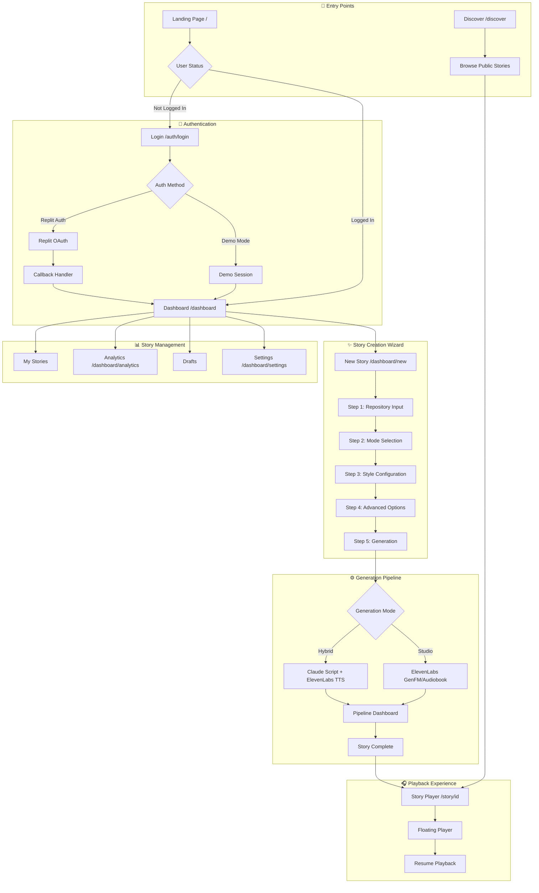

---

## 1. Landing Page

**Route:** `/`

**Purpose:** The entry point that introduces Code Tales and enables quick story creation from any GitHub repository.

### Visual Flow

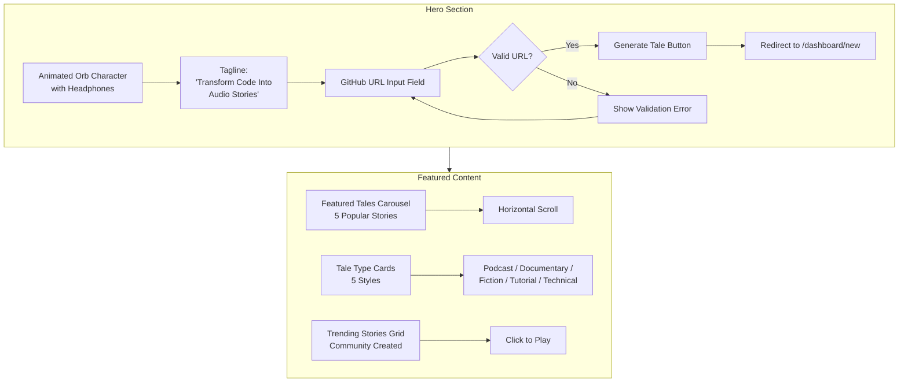

### Key Components

| Component | Description |
|-----------|-------------|
| **Hero Section** | Full-screen animated orb with headphones, tagline "Transform Code Into Audio Stories" |
| **GitHub URL Input** | Central input field for pasting repository URLs with real-time validation |
| **Featured Tales Carousel** | Horizontally scrolling showcase of top 5 popular stories |
| **Tale Types** | Five style option cards: Podcast, Documentary, Fiction, Tutorial, Technical |
| **Trending Stories** | Grid of community-created public stories with play counts |
| **Navigation** | Links to Discover, Dashboard, GitHub repo, Sign In |

### User Actions

1. **Paste GitHub URL** → Validates format → Click "Generate Tale" → Redirects to `/dashboard/new`
2. **Browse Featured Tales** → Click any tale card → Opens Story Player
3. **Sign In** → Redirects to `/auth/login`
4. **Try Popular Repos** → Quick-select buttons for repos like fastapi, langchain, next.js, shadcn-ui

### URL Validation

**Accepted Formats:**
- `https://github.com/owner/repo`
- `http://github.com/owner/repo`
- `github.com/owner/repo`
- `owner/repo` (shorthand)

---

## 2. Authentication Flow

**Routes:** `/auth/login`, `/api/auth/*`

**Purpose:** Secure user authentication via Replit's OAuth integration with optional demo mode.

### Authentication Sequence Diagram

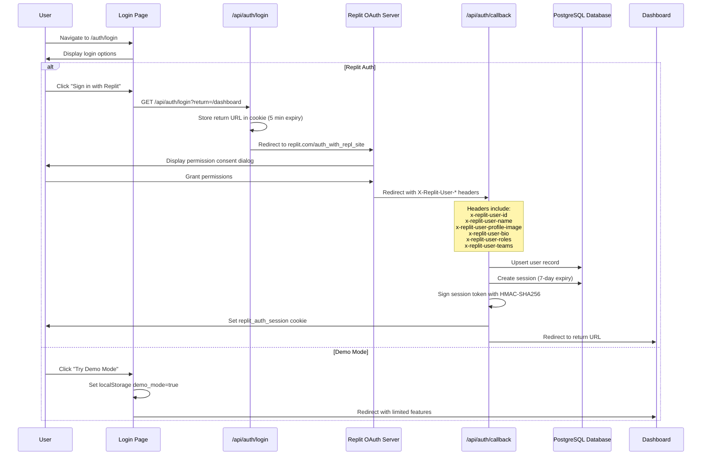

### Session Management

```mermaid
flowchart TD
    subgraph SessionCreation["Session Creation"]
        A[User Data from Replit] --> B[Generate UUID Session ID]
        B --> C[Sign with HMAC-SHA256]
        C --> D[Store in auth_sessions table]
        D --> E[Set HTTP-only Cookie]
    end
    
    subgraph SessionValidation["Session Validation"]
        F[Incoming Request] --> G{Has Cookie?}
        G -->|No| H[Return null user]
        G -->|Yes| I[Extract & verify signature]
        I --> J{Valid Signature?}
        J -->|No| H
        J -->|Yes| K[Query session from DB]
        K --> L{Session Expired?}
        L -->|Yes| H
        L -->|No| M[Fetch user record]
        M --> N[Return authenticated user]
    end
    
    subgraph SessionEnd["Session Termination"]
        O[User clicks Logout] --> P[Delete session from DB]
        P --> Q[Clear session cookie]
        Q --> R[Redirect to home]
    end
```

### Authentication Components

| Component | Description |
|-----------|-------------|
| **Session Token** | UUID signed with HMAC-SHA256 using SESSION_SECRET |
| **Cookie Name** | `replit_auth_session` |
| **Session Duration** | 7 days |
| **Cookie Flags** | `httpOnly`, `secure` (production), `sameSite: lax` |

### User Data Retrieved from Replit

| Header | Field | Description |
|--------|-------|-------------|
| `x-replit-user-id` | `id` | Unique Replit user ID |
| `x-replit-user-name` | `name` | Display username |
| `x-replit-user-profile-image` | `profileImageUrl` | Avatar URL |
| `x-replit-user-bio` | `bio` | User biography |
| `x-replit-user-roles` | `roles` | User roles |
| `x-replit-user-teams` | `teams` | Team memberships |

### Demo Mode Limitations

- Cannot save stories permanently
- Cannot access analytics
- Cannot set preferences
- Stories expire on session end
- Indicated by `localStorage.demo_mode = true`

---

## 3. Story Creation Wizard

**Route:** `/dashboard/new`

**Purpose:** Multi-step wizard guiding users through configuring and generating audio stories.

### Wizard Step Flow

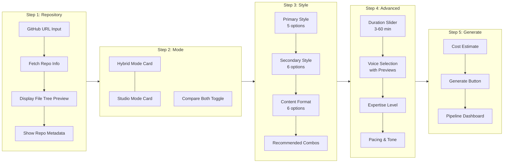

### Step 1: Repository Input

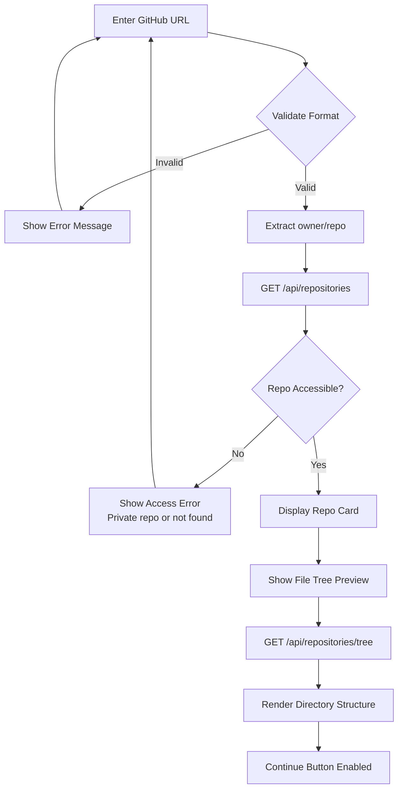

**Repository Preview Components:**

| Component | Description |
|-----------|-------------|
| **RepoInput** | URL field with GitHub icon, loading state, validation feedback |
| **Popular Repos Grid** | Quick-select: fastapi, langchain, next.js, shadcn-ui |
| **RepoTreePreview** | Collapsible directory structure with file counts |
| **Repo Metadata Card** | Stars, primary language, description, owner avatar |

### Step 2: Generation Mode Selection

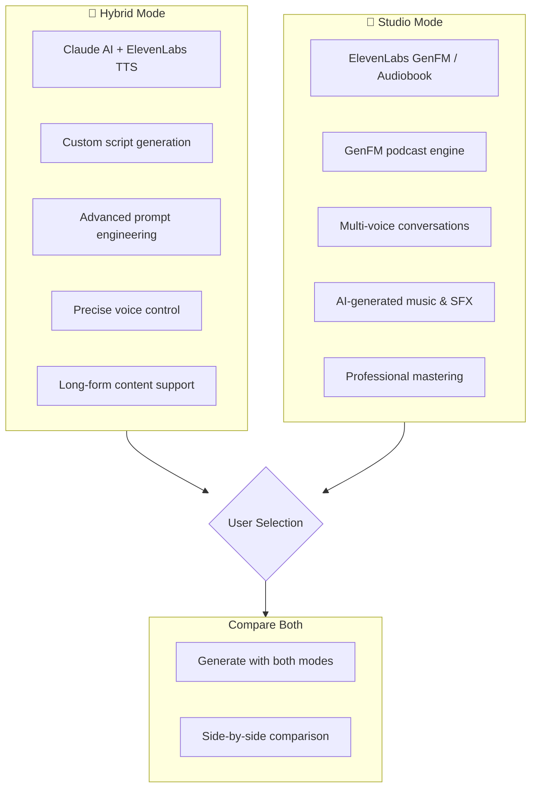

**Generation Mode Comparison:**

| Feature | Hybrid Mode | Studio Mode |
|---------|-------------|-------------|
| **Engine** | Claude AI + ElevenLabs TTS | ElevenLabs GenFM/Audiobook |
| **Script Control** | Full script editing | AI-generated script |
| **Voices** | Single voice, any ElevenLabs voice | Multi-voice, preset hosts |
| **Music/SFX** | Not included | AI-generated |
| **Best For** | Custom content, precise control | Professional production, podcasts |
| **Duration Support** | 3-60 minutes | Short/Default/Long presets |

**Default Mode per Style:**

| Narrative Style | Default Mode |
|-----------------|--------------|
| Podcast | Studio (GenFM) |
| Documentary | Hybrid |
| Fiction | Hybrid |
| Tutorial | Hybrid |
| Technical | Hybrid |

### Step 3: Style Configuration

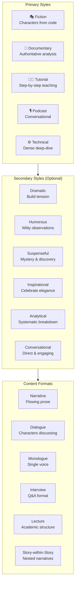

**Primary Style Details:**

| Style | Icon | Description | Best For |
|-------|------|-------------|----------|
| **Fiction** | 🎭 | Code components become story characters | Creative exploration, memorable learning |
| **Documentary** | 📰 | Authoritative, comprehensive analysis | Deep understanding, technical overview |
| **Tutorial** | 👨‍🏫 | Patient, step-by-step teaching | Learning new codebases, onboarding |
| **Podcast** | 🎙️ | Conversational, casual tone | Commute listening, casual exploration |
| **Technical** | ⚙️ | Dense, detailed deep-dive | Expert analysis, code review prep |

**Secondary Style Details:**

| Style | Effect |
|-------|--------|
| **Dramatic** | Builds tension and excitement around code discoveries |
| **Humorous** | Injects witty observations and light jokes |
| **Suspenseful** | Frames code exploration as mystery solving |
| **Inspirational** | Celebrates elegant code and architectural decisions |
| **Analytical** | Systematic, methodical breakdown of components |
| **Conversational** | Direct, engaging address to the listener |

**Content Format Details:**

| Format | Structure |
|--------|-----------|
| **Narrative** | Continuous flowing prose with seamless transitions |
| **Dialogue** | Multiple characters discussing and debating code |
| **Monologue** | Single authoritative voice exploration |
| **Interview** | Question and answer format with host and expert |
| **Lecture** | Academic structure with clear sections |
| **Story-within-Story** | Nested narratives for complex explanations |

### Step 4: Advanced Options

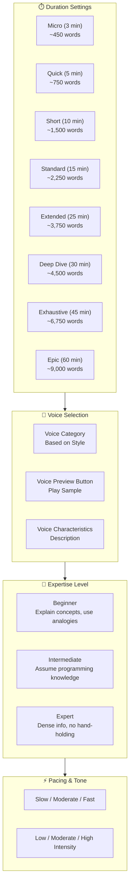

**Voice Options by Category:**

| Voice | Description | Category |
|-------|-------------|----------|
| **Rachel** | Warm, expressive | Fiction |
| **Adam** | Deep, authoritative | Fiction |
| **Daniel** | British storyteller | Fiction |
| **Drew** | Documentary style | Documentary |
| **Antoni** | Clear, precise | Technical |
| **Arnold** | Professional, crisp | Technical |
| **Bella** | Friendly, approachable | Tutorial |
| **Elli** | Conversational | Podcast |
| **Gigi** | Energetic presenter | Podcast |

**Duration Options:**

| Duration ID | Label | Minutes | Word Count |
|-------------|-------|---------|------------|
| micro | Micro | 3 | ~450 |
| quick | Quick | 5 | ~750 |
| short | Short | 10 | ~1,500 |
| standard | Standard | 15 | ~2,250 |
| extended | Extended | 25 | ~3,750 |
| deep | Deep Dive | 30 | ~4,500 |
| exhaustive | Exhaustive | 45 | ~6,750 |
| epic | Epic | 60 | ~9,000 |

### Step 5: Generate & Estimate

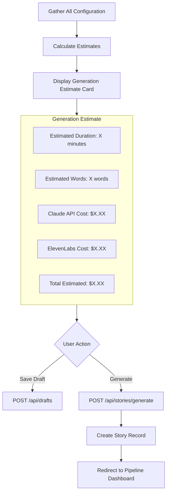

### Draft Management

Users can save their configuration at any point:

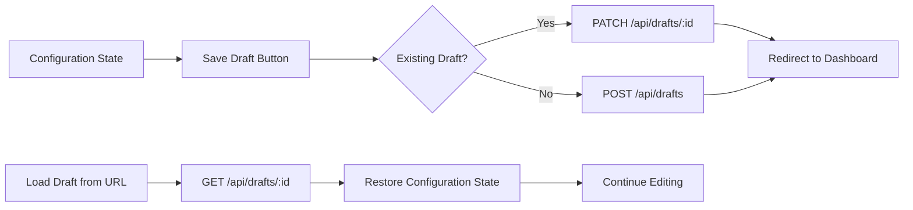

---

## 4. Pipeline Visibility

**Route:** `/dashboard/story/[id]` during generation

**Purpose:** Real-time transparency into the multi-stage story generation process.

### Pipeline State Machine

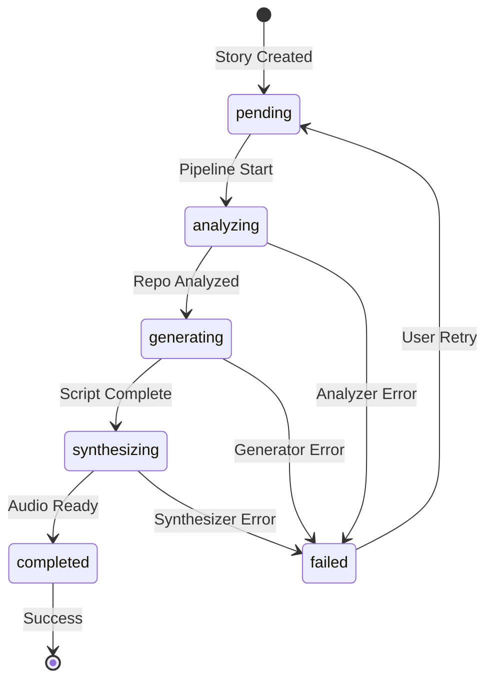

### Pipeline Dashboard Architecture

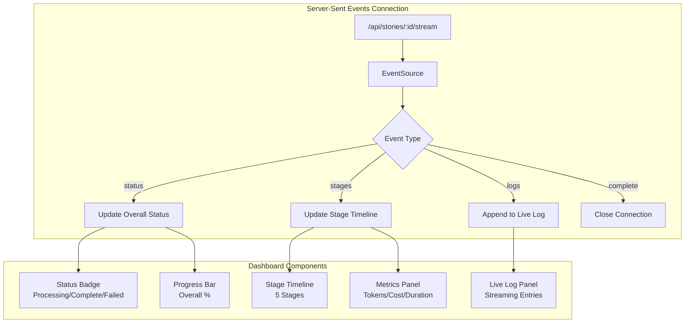

### Stage Timeline Component

```mermaid
flowchart LR
    subgraph Analyzer["🔍 Analyzer"]
        A1[Fetch Repository]
        A2[Parse File Structure]
        A3[Identify Key Components]
    end
    
    subgraph Narrator["📖 Narrator"]
        B1[Generate Script Outline]
        B2[Write Full Script]
        B3[Add Style Elements]
    end
    
    subgraph Parser["📄 Parser"]
        C1[Validate Script]
        C2[Extract Chapters]
        C3[Format for TTS]
    end
    
    subgraph Synthesizer["🎙️ Synthesizer"]
        D1[Send to ElevenLabs]
        D2[Process Audio Chunks]
        D3[Concatenate & Master]
    end
    
    subgraph Complete["✅ Complete"]
        E1[Store Audio]
        E2[Update Story Record]
        E3[Ready for Playback]
    end
    
    Analyzer --> Narrator
    Narrator --> Parser
    Parser --> Synthesizer
    Synthesizer --> Complete
```

**Stage Status Indicators:**

| Status | Icon | Color | Description |
|--------|------|-------|-------------|
| **Pending** | Clock | Gray | Waiting to start |
| **Running** | Loader (spinning) | Primary | Currently processing |
| **Completed** | CheckCircle | Green | Successfully finished |
| **Failed** | AlertCircle | Red | Error occurred |

**Stage Configuration:**

| Stage | Icon | Label | Typical Duration |
|-------|------|-------|------------------|
| `analyzer` | Search | Analyzer | 10-30 seconds |
| `narrator` | BookOpen | Narrator | 30-120 seconds |
| `parser` | FileCode | Parser | 5-15 seconds |
| `synthesizer` | Mic | Synthesizer | 60-300 seconds |
| `complete` | CheckCircle | Complete | Instant |

### Live Log Component

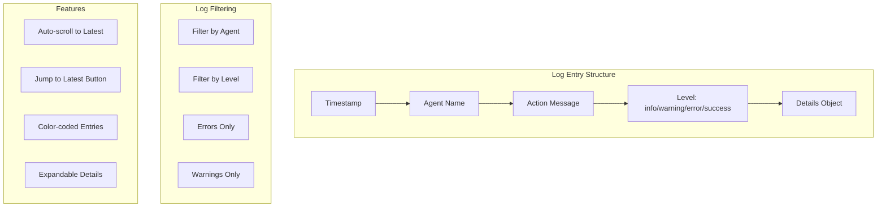

**Agent Color Coding:**

| Agent | Icon | Color | Purpose |
|-------|------|-------|---------|
| **Analyzer** | Search | Blue | Repository analysis |
| **Narrator** | BookOpen | Green | Script generation |
| **Parser** | FileCode | Purple | Script parsing |
| **Synthesizer** | Mic | Orange | Audio synthesis |
| **System** | Cpu | Gray | System events |

**Log Level Styling:**

| Level | Icon | Color | Background |
|-------|------|-------|------------|
| `info` | Info | Muted | Default |
| `warning` | AlertTriangle | Yellow | Yellow/10 |
| `error` | AlertCircle | Red | Red/10 |
| `success` | CheckCircle2 | Green | Green/10 |

### Metrics Panel

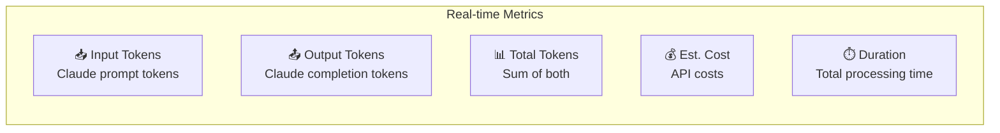

**Metrics Tracked:**

| Metric | Icon | Color | Format |
|--------|------|-------|--------|
| Input Tokens | TrendingUp | Blue | X.Xk |
| Output Tokens | Zap | Green | X.Xk |
| Total Tokens | TrendingUp | Purple | X.Xk |
| Est. Cost | Coins | Yellow | $X.XXXX |
| Duration | Clock | Orange | Xm Xs |

### Real-Time Updates via SSE

**Event Types:**

```typescript
// Status event - overall pipeline status
eventSource.addEventListener("status", (event) => {
  const data = JSON.parse(event.data)
  // { storyId, status, progress, progressMessage, generationMode }
})

// Stages event - individual stage updates
eventSource.addEventListener("stages", (event) => {
  const data = JSON.parse(event.data)
  // Array of { stageName, status, stageOrder, durationMs, inputTokens, outputTokens, costEstimate }
})

// Logs event - streaming log entries
eventSource.addEventListener("logs", (event) => {
  const data = JSON.parse(event.data)
  // Array of { timestamp, agentName, action, level, details }
})

// Complete event - generation finished
eventSource.addEventListener("complete", (event) => {
  const data = JSON.parse(event.data)
  // { status: "completed" | "failed" }
})
```

---

## 5. Story Playback Experience

**Routes:** `/story/[id]`, Floating Player (global)

**Purpose:** Immersive audio playback with comprehensive controls, chapter navigation, and cross-session resume.

### Playback Architecture

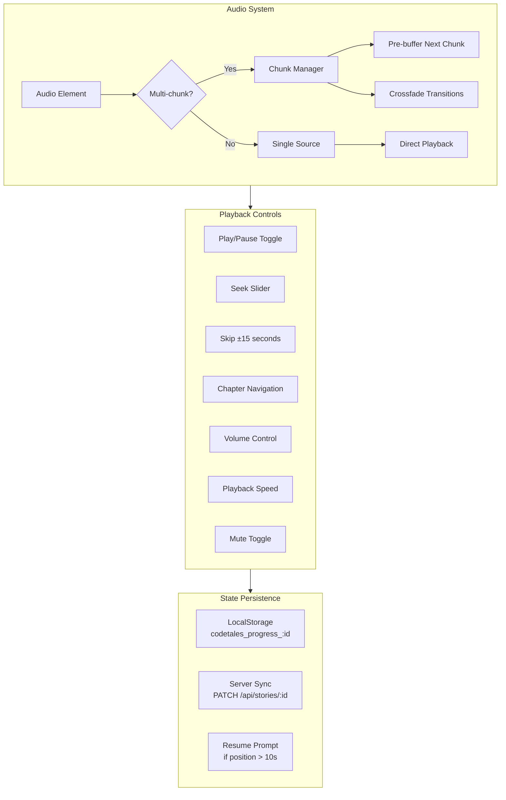

### Story Player Components

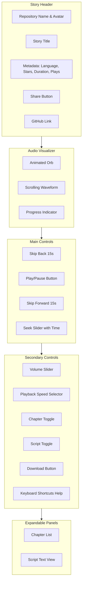

### Keyboard Shortcuts

| Key | Action | Visual Feedback |
|-----|--------|-----------------|
| `Space` | Play/Pause | Button animation |
| `K` | Play/Pause (YouTube style) | Button animation |
| `←` or `J` | Seek back 10 seconds | "−10s" overlay |
| `→` or `L` | Seek forward 10 seconds | "+10s" overlay |
| `↑` | Volume up 10% | Volume indicator |
| `↓` | Volume down 10% | Volume indicator |
| `M` | Mute/Unmute toggle | Mute icon change |
| `0` - `9` | Jump to percentage (0=0%, 5=50%, 9=90%) | Seek position |
| `C` | Toggle chapter panel | Panel slide |
| `S` | Toggle script panel | Panel slide |

### Resume Playback Flow

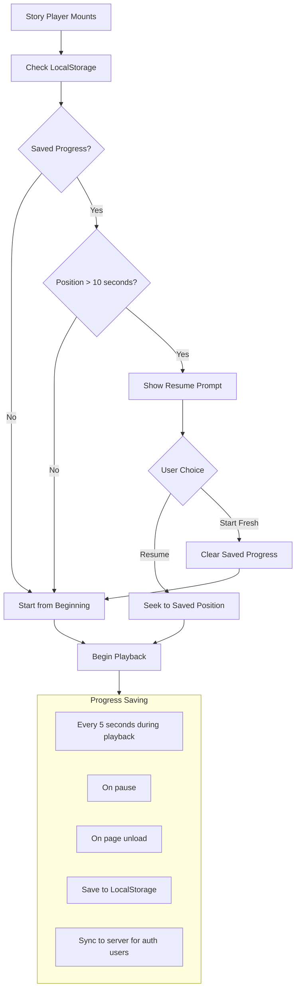

**LocalStorage Progress Format:**

```typescript
interface SavedProgress {
  currentChunk: number      // For multi-part audio
  currentTime: number       // Global timestamp in seconds
  lastPlayed: string        // ISO timestamp
}

// Storage key pattern
const key = `codetales_progress_${storyId}`
```

### Multi-Part Audio Support

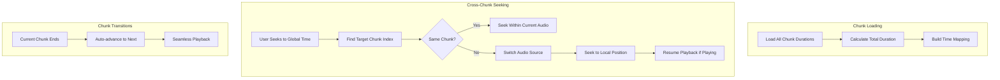

**Chunk Management:**

| Feature | Implementation |
|---------|----------------|
| **Duration Calculation** | Sum of all chunk durations |
| **Time Mapping** | `getChunkStartTime()` calculates offset |
| **Seeking** | `findChunkForTime()` locates chunk and local position |
| **Transitions** | `onEnded` event triggers next chunk load |

### Floating Player

```mermaid
flowchart TD
    subgraph States["Player States"]
        A[Hidden - No active audio]
        B[Mini Bar - Collapsed view]
        C[Expanded - Full controls + queue]
    end
    
    subgraph MiniBar["Mini Bar Features"]
        D[Waveform Animation]
        E[Track Title Link]
        F[Play/Pause]
        G[Skip Controls]
        H[Expand Button]
        I[Close Button]
    end
    
    subgraph ExpandedView["Expanded Features"]
        J[All Mini Bar Features]
        K[Volume Slider]
        L[Speed Selector]
        M[Skip ±10s]
        N[Queue Panel]
        O[Queue Management]
    end
    
    A -->|Play Story| B
    B -->|Expand| C
    C -->|Collapse| B
    B -->|Close| A
```

**Floating Player Controls:**

| Control | Desktop | Mobile |
|---------|---------|--------|
| Play/Pause | ✅ | ✅ |
| Skip Previous | ✅ | Hidden |
| Skip Next | ✅ | Hidden |
| Skip ±10s | ✅ | Expand only |
| Volume | ✅ | Expand only |
| Speed | ✅ | Expand only |
| Queue | ✅ | Expand only |

### Playback Speed Options

| Speed | Label |
|-------|-------|
| 0.5x | Half speed |
| 0.75x | Slower |
| 1x | Normal |
| 1.25x | Faster |
| 1.5x | Fast |
| 2x | Double speed |

---

## 6. Dashboard Features

**Route:** `/dashboard`

**Purpose:** Personal hub for managing stories, resuming playback, viewing analytics, and configuring preferences.

### Dashboard Layout

```mermaid
flowchart TD
    subgraph Header["Dashboard Header"]
        A[Tali Mascot with Greeting]
        B[Create New Tale Button]
    end
    
    subgraph ContinueListening["Continue Listening Section"]
        C{Has In-Progress Story?}
        C -->|Yes| D[Story Card with Progress Bar]
        D --> E[One-Click Resume Button]
        C -->|No| F[Section Hidden]
    end
    
    subgraph MyStories["My Stories Grid"]
        G[Story Cards Grid]
        H[Status Badges]
        I[Duration & Date]
        J[Actions Dropdown]
    end
    
    subgraph Drafts["Drafts Section"]
        K[Saved Draft Cards]
        L[Resume Draft Button]
        M[Delete Draft Option]
    end
    
    subgraph Trending["Trending Community"]
        N[Top Public Stories]
        O[Play Counts]
        P[Other Users' Content]
    end
    
    Header --> ContinueListening
    ContinueListening --> MyStories
    MyStories --> Drafts
    Drafts --> Trending
```

### Story Status Badges

| Status | Color | Label | Action Available |
|--------|-------|-------|------------------|
| `pending` | Gray | "Pending" | View Pipeline |
| `analyzing` | Blue | "Analyzing" | View Pipeline |
| `generating` | Yellow | "Generating" | View Pipeline |
| `synthesizing` | Purple | "Synthesizing" | View Pipeline |
| `completed` | Green | "Completed" | Play, Edit, Share, Delete |
| `failed` | Red | "Failed" | Retry, Delete |

### Story Card Actions

```mermaid
flowchart LR
    A[Story Card] --> B[Actions Menu]
    B --> C[Play - Opens Player]
    B --> D[View Pipeline - Processing Details]
    B --> E[Edit - Modify Settings]
    B --> F[Download - Save Audio]
    B --> G[Share - Public Link]
    B --> H[Delete - Remove Story]
```

### Analytics Page

**Route:** `/dashboard/analytics`

```mermaid
flowchart TD
    subgraph Stats["Summary Statistics"]
        A[Total Stories Created]
        B[Completed Stories]
        C[Total Plays Received]
        D[Total Listening Time]
        E[Average Plays per Story]
    end
    
    subgraph Charts["Visualizations"]
        F[Plays Over Time - 30 Day Chart]
        G[Story Distribution by Style]
        H[Most Popular Story]
    end
    
    subgraph Insights["Insights"]
        I[Best Performing Style]
        J[Peak Listening Hours]
        K[Engagement Trends]
    end
    
    Stats --> Charts
    Charts --> Insights
```

**Metrics Displayed:**

| Metric | Description |
|--------|-------------|
| **Total Stories** | Count of all user-created stories |
| **Completed Stories** | Successfully generated stories |
| **Total Plays** | Sum of play counts across all stories |
| **Listening Time** | Cumulative hours of content played |
| **Avg Plays/Story** | Mean engagement metric |
| **Most Popular Story** | Story with highest play count |

### Settings Page

**Route:** `/dashboard/settings`

```mermaid
flowchart TD
    subgraph Profile["Profile Settings"]
        A[Display Name]
        B[Email Preferences]
        C[Avatar]
    end
    
    subgraph Defaults["Default Preferences"]
        D[Default Narrative Style]
        E[Default Duration]
        F[Preferred Voice]
        G[Expertise Level]
    end
    
    subgraph Theme["Appearance"]
        H[Theme: Light/Dark/System]
    end
    
    subgraph Account["Account Management"]
        I[Export Data]
        J[Delete Account]
    end
```

### Drafts Management

```mermaid
flowchart TD
    A[Draft Card] --> B[Show Repository Info]
    B --> C[Show Style Configuration]
    C --> D[Show Last Updated]
    D --> E{User Action}
    E -->|Edit| F[Open in Wizard]
    E -->|Generate| G[Start Generation]
    E -->|Delete| H[Remove Draft]
    
    F --> I[Resume from Step 2+]
    G --> J[Pipeline Dashboard]
```

---

## 7. API Reference

### Authentication Endpoints

| Endpoint | Method | Description |
|----------|--------|-------------|
| `/api/auth/login` | GET | Initiate Replit OAuth, stores return URL |
| `/api/auth/callback` | GET | Handle OAuth callback, create session |
| `/api/auth/logout` | POST | Destroy session, clear cookie |
| `/api/auth/user` | GET | Get current authenticated user |

### Story Endpoints

| Endpoint | Method | Description |
|----------|--------|-------------|
| `/api/stories` | GET | List user's stories |
| `/api/stories` | POST | Create new story record |
| `/api/stories/[id]` | GET | Get story details |
| `/api/stories/[id]` | PATCH | Update story (e.g., last_played_position) |
| `/api/stories/[id]` | DELETE | Delete story and audio |
| `/api/stories/[id]/status` | GET | Get generation status |
| `/api/stories/[id]/stream` | GET | SSE stream for pipeline updates |
| `/api/stories/[id]/stages` | GET | Get pipeline stage details |
| `/api/stories/[id]/logs` | GET | Get processing logs |
| `/api/stories/[id]/play-count` | POST | Increment play count |
| `/api/stories/[id]/restart` | POST | Retry failed generation |
| `/api/stories/[id]/download` | GET | Download audio file |
| `/api/stories/generate` | POST | Start Hybrid mode generation |
| `/api/stories/generate-studio` | POST | Start Studio mode generation |
| `/api/stories/generate-compare` | POST | Generate with both modes |
| `/api/stories/public` | GET | List public stories |
| `/api/stories/regenerate-audio` | POST | Regenerate audio only |
| `/api/stories/regenerate-batch` | POST | Batch regeneration |

### Repository Endpoints

| Endpoint | Method | Description |
|----------|--------|-------------|
| `/api/repositories` | GET | Fetch repository info from GitHub |
| `/api/repositories/tree` | GET | Fetch file tree structure |

### Voice Endpoints

| Endpoint | Method | Description |
|----------|--------|-------------|
| `/api/voices` | GET | List available ElevenLabs voices |
| `/api/voices/preview` | POST | Generate voice preview sample |

### Draft Endpoints

| Endpoint | Method | Description |
|----------|--------|-------------|
| `/api/drafts` | GET | List user's drafts |
| `/api/drafts` | POST | Create new draft |
| `/api/drafts/[id]` | GET | Get draft details |
| `/api/drafts/[id]` | PATCH | Update draft |
| `/api/drafts/[id]` | DELETE | Delete draft |

### Other Endpoints

| Endpoint | Method | Description |
|----------|--------|-------------|
| `/api/audio` | GET | Serve audio files from storage |
| `/api/analytics` | GET | User analytics data |
| `/api/models` | GET | Available AI models |
| `/api/chat/intent` | POST | Intent chat for configuration help |

---

## Database Schema Summary

| Table | Purpose | Key Fields |
|-------|---------|------------|
| `users` | User accounts from Replit Auth | id, email, firstName, lastName, profileImageUrl |
| `auth_sessions` | Signed session tokens | id, userId, expiresAt |
| `code_repositories` | Analyzed GitHub repos | repoOwner, repoName, primaryLanguage, starsCount |
| `stories` | Generated audio stories | title, status, audioUrl, audioChunks, narrativeStyle |
| `story_chapters` | Chapter metadata | storyId, chapterNumber, title, startTimeSeconds |
| `story_drafts` | Saved but not generated | repositoryUrl, styleConfig, voiceConfig |
| `processing_logs` | Pipeline telemetry | storyId, agentName, action, level, timestamp |

---

## Storage Architecture

**Replit Object Storage:**
- **Public Path:** `/public/` - Publicly accessible assets
- **Private Path:** `/.private/audio/{storyId}/` - User audio files

**Audio Serving:**
- Served via `/api/audio?path=...`
- Signed URLs for private content
- Multi-chunk file support for long stories

---

## Mobile Responsiveness

| Screen | Desktop | Tablet | Mobile |
|--------|---------|--------|--------|
| Landing | Full hero, side-by-side | Stacked layout | Single column |
| Login | Centered card | Centered card | Full-width card |
| Dashboard | Grid view | 2-column grid | Single column |
| Creation Wizard | Multi-step sidebar | Multi-step | Stepper navigation |
| Story Player | Side controls | Stacked | Compact controls |
| Floating Player | Full controls | Full controls | Mini bar only |
| Analytics | Charts side-by-side | Stacked | Single column |

---

*Last Updated: January 12, 2026*
